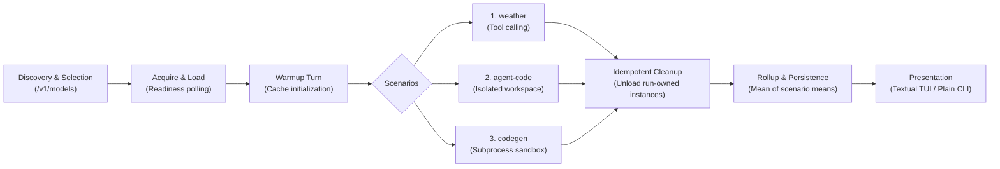

# llmsweep

<p align="center">
  <strong>Benchmark agentic, coding, and throughput performance of local LM Studio models.</strong>
</p>

<p align="center">
  
  
  
  
  
  
</p>

---

`llmsweep` is a developer-focused benchmarking suite and interactive [Textual](https://textual.textualize.io/) terminal user interface (TUI) for local Large Language Models running on [LM Studio](https://lmstudio.ai/).

Rather than relying on synthetic prompts or server-side API optimism, `llmsweep` exercises models against real-world multi-step tool use, codebase navigation and bug fixing, and algorithmic code synthesis. It measures **client-observed throughput**, **time-to-first-token (TTFT)**, and **lifecycle loading latency** with statistical rigor, and features built-in baseline regression gating for automated CI/CD testing.

---

## Benchmark Execution Flow



---

## Key Highlights

- 🛠️ **Three Realistic Scenarios**:
  - **`weather`**: Multi-turn OpenAI-compatible function calling with parameter validation and regex verification.
  - **`agent-code`**: Agentic workspace inspection (`list_files`, `read_file`, `grep_files`), guarded bug fixing (`write_file`), and independent test runner verification.
  - **`codegen`**: Algorithmic Python synthesis from strict specifications, validated inside a sandboxed subprocess with execution timeouts.
- ⏱️ **Client-Observed Measurement Fidelity**:
  - Dispatched-to-first-token latency (**TTFT**), excluding role-only headers and empty usage frames.
  - Streamed-window throughput (**tok/s**), calculated strictly from first to last token chunk.
  - Model throughput aggregated as the **mean of scenario means** to prevent scenario length bias.
  - Multi-run statistical rollups: **Mean**, **Median**, and **Nearest-Rank p95**.
- 🔄 **Lifecycle & Resource Protection**:
  - Automated loading with 1-second readiness polling and load duration tracking.
  - Primes compute pipelines and KV-caches with a single warmup query.
  - Guaranteed idempotent unload: only unloads instances created during the active benchmark run, preserving pre-existing models.
- 🖥️ **Dual Interface**:
  - **Textual TUI**: Interactive Model Picker, live streaming dashboard (buffered at 75 ms intervals for 1000+ deltas/sec), latency sparklines, and transcript inspector.
  - **Plain CLI**: Pipeable, deterministic, ANSI-free plain text tables ideal for terminal scripts, redirected logs, and CI pipelines.
- 📉 **Regression Gating**:
  - Compare results against historical `--baseline` runs. Automatically flags regressions $> 5\%$ on scenario means and exits with code `3`.
- 💾 **Local Offline Storage**:
  - Fully schema-versioned runs and turn-by-turn transcripts written atomically to disk. View or export (`json`, `csv`, `markdown`) completely offline.

---

## Terminal Preview (Plain CLI)

```text
╭─────────────────────────────────── llmsweep v1.0.0 ────────────────────────────────────╮
│ Target: http://localhost:1234 (API v1)  •  Scenarios: weather, agent-code, codegen     │
╰────────────────────────────────────────────────────────────────────────────────────────╯

Model Ref                        Params   Load (s)   TTFT (ms)    Tok/s    Weather  Agent    Codegen   Overall
─────────────────────────────────────────────────────────────────────────────────────────────────────────────
qwen2.5-coder-7b-instruct         7.6B      4.12s      184ms      68.4      Pass     Pass     Pass      3/3
deepseek-coder-6.7b-instruct      6.7B      3.89s      210ms      57.2      Pass     Pass     Pass      3/3
llama-3.2-3b-instruct             3.2B      1.85s      112ms      96.1      Pass     Fail     Pass      2/3
─────────────────────────────────────────────────────────────────────────────────────────────────────────────
Summary: 3 models evaluated, 9 scenario samples completed, 0 runtime errors.
Run persisted to ~/.local/share/llmsweep/runs/20260922_041012_lmstudio.json
```

---

## Benchmark Scenarios Overview

| Scenario | Focus | Tools Provided | Verification Criteria |
| :--- | :--- | :--- | :--- |
| [**`weather`**](docs/scenarios.md#2-weather--structured-tool-calling) | Multi-Turn Tool Use | `get_weather(location, unit)` | Validates tool schema formatting, required tool call invocation, and regex temperature consistency in final response. |
| [**`agent-code`**](docs/scenarios.md#3-agent-code--agentic-coding--bug-fixing) | Autonomous Bug Fixing | `list_files`, `read_file`, `grep_files`, `write_file` | Enforces path confinement (no traversal/symlink escapes), requires mutation via `write_file`, and validates fix by running an independent test suite in an isolated subprocess. |
| [**`codegen`**](docs/scenarios.md#4-codegen--algorithmic-code-synthesis) | Zero-Shot Code Generation | *None* (pure prompt) | Extracts fenced or valid unfenced Python code and runs a mathematical Fibonacci test battery in a subprocess sandbox with a 15-second execution timeout. |

*Read the complete scenario specifications in [docs/scenarios.md](docs/scenarios.md).*

---

## Installation

### Prerequisites

- **Python**: 3.11 or newer
- **Operating System**: macOS or Linux
- **LM Studio**: Running locally with developer server enabled (default: `http://localhost:1234`).

### Using `uv` (Recommended)

```bash
# Clone the repository
git clone https://github.com/jamesbrendamour/llm-bench.git
cd llm-bench

# Install package
uv pip install .

# For development (includes pytest, textual-dev, ruff, mypy)
uv pip install -e ".[dev]"
```

### Using Standard `pip`

```bash
pip install .
```

---

## Quick Start & Common Recipes

### 1. Interactive TUI Exploration
Launch the interactive model picker to browse models, inspect parameter counts, and watch live benchmark streaming:

```bash
llmsweep run
```

### 2. Benchmark Specific Models by Name or Substring
Benchmark targeted models in headless plain text mode:

```bash
llmsweep run --plain --models "qwen2.5-coder-7b,deepseek-coder"
```

### 3. Select Models by Index Range
List models, then run benchmarks against indices `1`, `2`, `3`, and `5`:

```bash
llmsweep list
llmsweep run --plain --models "1-3,5" --repeat 3
```

### 4. Continuous Integration Regression Test
Assert current performance against an established baseline in CI pipelines:

```bash
llmsweep run --plain \
  --models "qwen2.5-coder-7b-instruct" \
  --baseline "baselines/qwen_v1.json" \
  --json "artifacts/latest_run.json"
```
*If throughput or TTFT degrades by $> 5\%$, `llmsweep` returns exit code `3`.*

### 5. Inspect Past Runs Offline
Review results and full conversational transcripts without connecting to the server:

```bash
llmsweep show 20260922_041012_lmstudio --transcripts
```

---

## CLI Command Reference

### Core Subcommands

- **`llmsweep run [OPTIONS]`**: Execute benchmark scenarios.
- **`llmsweep list`**: List chat models available in LM Studio (excluding embeddings/rerankers).
- **`llmsweep show <run-id|file>`**: Inspect stored benchmark results and turn transcripts.
- **`llmsweep export <run-id> --format <json|csv|md>`**: Export past runs to JSON, CSV, or Markdown.
- **`llmsweep doctor`**: Diagnose server connectivity, API version (v1/v0), and store health.
- **`llmsweep providers`**: Display status of supported backend providers (`lmstudio`).

### `llmsweep run` Flags

| Flag | Type | Default | Description |
| :--- | :---: | :---: | :--- |
| `-m, --models <spec>` | String | *Picker* | Target models: exact IDs, index ranges (`1-3,5`), or unique substrings. |
| `-a, --all` | Flag | `False` | Run benchmarks against all available chat models. |
| `-s, --scenarios <list>` | String | `all` | Scenarios to execute: `weather`, `agent-code`, `codegen`. |
| `-r, --repeat <n>` | Integer | `1` | Number of test repetitions per scenario per model. |
| `--plain` | Flag | `False` | Force ANSI-free plain text output (auto-enabled in pipes or CI). |
| `--baseline <path>` | Path | `None` | Path to prior run JSON file for regression detection ($> 5\%$). |
| `--task <prompt>` | String | `None` | Custom prompt for `weather` scenario (disables automatic scoring). |
| `--require-tool-use` | Flag | `False` | Filter models to only those explicitly advertising tool-calling support. |
| `--keep-loaded` | Flag | `False` | Prevent unloading of run-instantiated models. (Alias: `--no-unload`). |
| `--parallel` | Flag | `False` | Run benchmarks concurrently across models (requires all models preloaded). |
| `--json <path>` | Path | `None` | Save run results to specified JSON file. |
| `--csv <path>` | Path | `None` | Save scenario summary table to CSV. |
| `--markdown <path>` | Path | `None` | Save formatted results report as Markdown. |
| `--timeout <sec>` | Integer | `300` | Inactivity timeout in seconds for streaming API requests. |
| `--load-deadline <sec>` | Integer | `600` | Maximum wait time in seconds for model loading and readiness. |

*For complete flag details, see [docs/cli_reference.md](docs/cli_reference.md).*

---

## Model Selection Syntax

When specifying `--models <spec>`, `llmsweep` resolves terms using a deterministic priority hierarchy:

1. **Exact Ref**: Matches `provider:id` or exact ID (e.g. `lmstudio:qwen2.5-coder-7b-instruct`).
2. **1-Based Index Ranges**: Matches positions from `llmsweep list`. Supports single indices (`1`), comma-separated lists (`1,3,5`), and continuous hyphenated ranges (`1-3,5-7`).
3. **Unique Substring**: Case-insensitive substring match (e.g. `coder-7b`). Ambiguous matches raise a descriptive error without guessing.

---

## Measurement Methodology & Scoring

`llmsweep` adheres to strict measurement principles:

1. **Time-To-First-Token (TTFT)**:
   - Starts when HTTP request bytes are dispatched over the socket.
   - Stops on the arrival of the first substantive delta (`TextDelta`, `ReasoningDelta`, `ToolCallDelta`). Role envelopes and empty usage headers do not count.
2. **Client-Observed Throughput**:
   - Calculated strictly over the active generation window:
     $$\text{Throughput (tok/s)} = \frac{\text{Output Tokens}}{t_{\text{last\_delta}} - t_{\text{first\_delta}}}$$
   - Excludes server queuing, model loading, warmup invocation, and tool/checker execution time.
   - Overall model throughput is computed as the **mean of scenario means**.
3. **Token Accounting**:
   - Prefers API-reported completion token counts (including reasoning tokens).
   - Fallback: Chunk-independent UTF-8 byte estimate $\lceil \text{bytes} / 4 \rceil$. Preserves and displays `token_source` on every record.
4. **Statistical Rollups**:
   - Multi-repeat runs report **Mean**, **Median**, and **Nearest-Rank p95** distributions.

*Read the full mathematical breakdown in [docs/metrics_and_scoring.md](docs/metrics_and_scoring.md).*

---

## Interactive TUI (Textual)

Running `llmsweep run` in an interactive terminal opens the full Textual TUI:

- **Model Picker**: Interactive list with search filtering, parameter sizes, and selection toggling.
- **Live Streaming Runner**: Real-time progress bars, response streaming (buffered at 75 ms intervals to prevent UI stutter), and per-turn metrics.
- **Results Dashboard**: Summary tables with TTFT, tok/s, pass/fail status, and color-coded regression arrows.
- **Transcript Viewer**: Drill down into raw turn messages, tool calls, and model completions.

### TUI Keyboard Shortcuts

| Shortcut | Action |
| :--- | :--- |
| `Space` | Toggle model selection in Picker |
| `Enter` | Confirm selection / Start benchmark run |
| `Tab` / `Shift+Tab` | Navigate between screens, tables, and views |
| `Ctrl+C` | Cancel active model (saves partial results and triggers clean unload) |
| `Ctrl+Q` | Quit application |
| `?` | Toggle Help modal |

---

## Configuration & Precedence

Configuration values are resolved using the following order of precedence:

1. **CLI Flags**: (`--models`, `--repeat`, `--timeout`, etc.)
2. **Environment Variables**:
   - `LLMSWEEP_HOST`: LM Studio server URL (default: `http://localhost:1234`)
   - `LLMSWEEP_API_KEY`: API key if authentication is enabled (redacted in logs)
   - `LLMSWEEP_TIMEOUT`: Default request timeout in seconds
   - `LLMSWEEP_DATA_DIR`: Directory for storing run artifacts and transcripts
   - `LLMSWEEP_PLAIN`: Force plain text mode (`1` or `true`)
3. **Project Config File**: `llmsweep.toml` or `pyproject.toml` in the current working directory.
4. **User Config File**: `~/.config/llmsweep/config.toml` (or platform equivalent).

### Example Configuration (`llmsweep.toml`)

```toml
[server]
host = "http://localhost:1234"
timeout = 300.0
load_deadline = 600.0

[benchmark]
repeat = 3
scenarios = ["weather", "agent-code", "codegen"]
require_tool_use = false
keep_loaded = false

[regression]
threshold_pct = 5.0
```

---

## Exit Codes

`llmsweep` provides standard exit codes for automated testing and CI pipelines:

| Exit Code | Meaning | Cause |
| :---: | :--- | :--- |
| **`0`** | **Success** | All benchmarks completed without errors or threshold regressions. |
| **`1`** | **Model Error** | One or more models encountered an unrecoverable execution or API error. |
| **`2`** | **Setup / Config Error** | Invalid flags, unparseable model/scenario expressions, or missing config. |
| **`3`** | **Regression Failure** | Benchmarks completed, but throughput or TTFT regressed $> 5\%$ vs baseline. |
| **`4`** | **Auth Failure** | Non-retryable authentication or authorization error (HTTP 401/403). |

---

## Documentation Index

Explore the comprehensive guides in the [`docs/`](docs/) directory:

- 📖 [**Documentation Overview**](docs/index.md): System summary and architectural roadmap.
- 🏗️ [**Architecture & Internals**](docs/architecture.md): Event-driven runner, SSE parsing, and provider adapters.
- 🎯 [**Benchmark Scenarios**](docs/scenarios.md): In-depth breakdown of `weather`, `agent-code`, and `codegen`.
- 📐 [**Metrics & Methodology**](docs/metrics_and_scoring.md): Statistical formulas, token fallbacks, and regression math.
- ⌨️ [**CLI Reference**](docs/cli_reference.md): Full flag documentation, configuration options, and environment variables.
- 💡 [**Design Rationale & Assumptions**](docs/design_rationale_and_assumptions.md): Engineering decisions, API fallbacks, and trade-offs.

---

## Development & Testing

All test suites in `llmsweep` are fully self-contained and run completely offline. An autouse socket guard rejects any unintended network access during test runs.

```bash
# Run unit and contract tests
pytest

# Run linter checks
ruff check

# Run strict type checking
mypy --strict

# Auto-format codebase
ruff format
```

---

## License

This project is licensed under the MIT License. See [LICENSE](LICENSE) for details.
