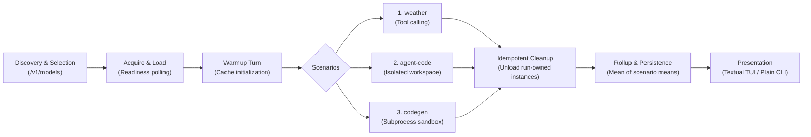
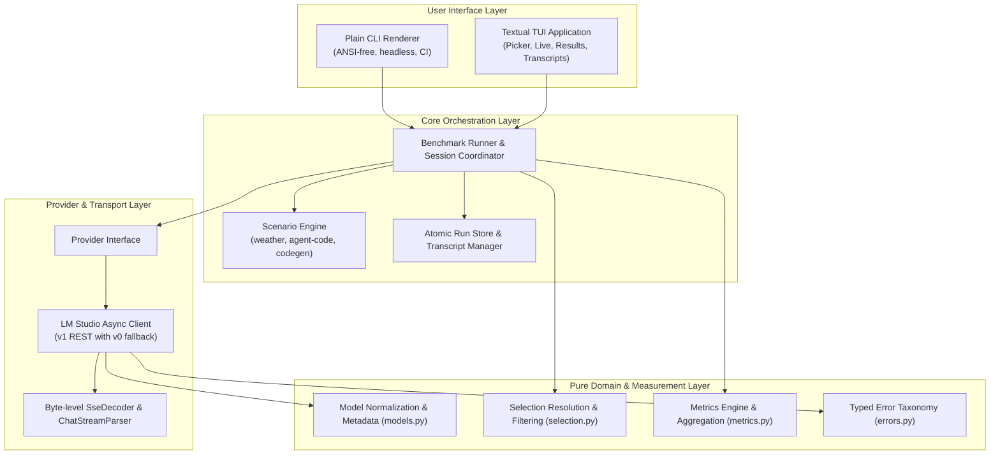
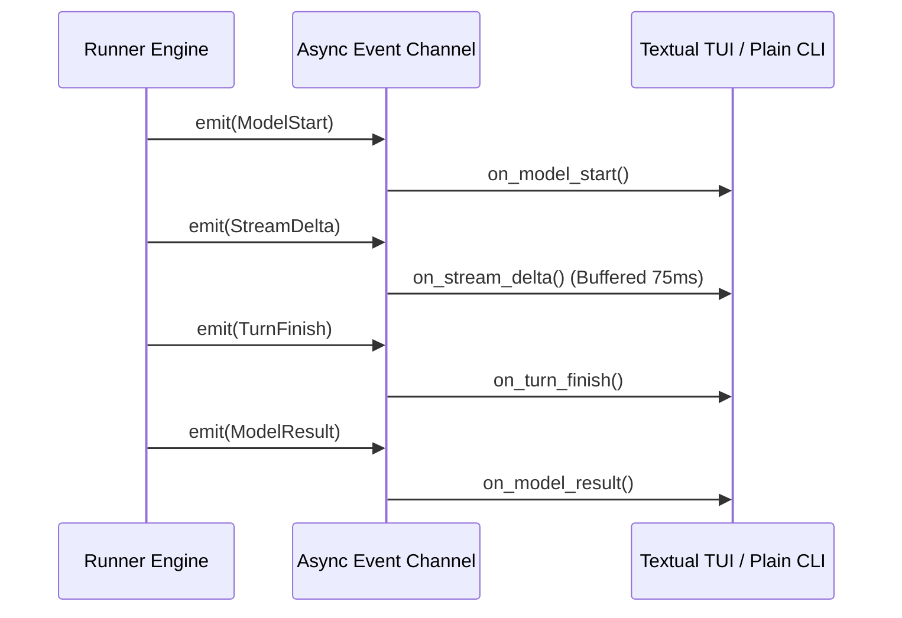
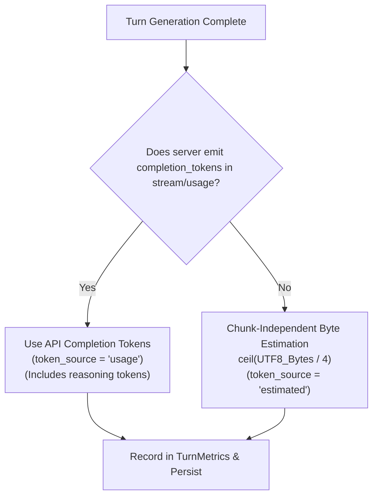
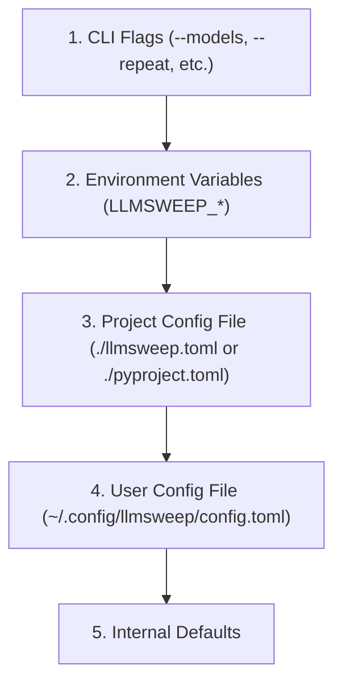

# llmsweep

<p align="center">
  <strong>Benchmark agentic, coding, and throughput performance of local LM Studio models.</strong>
</p>

<p align="center">
  
  
  
  
  
  
</p>

---

`llmsweep` is a developer-focused benchmarking suite and interactive [Textual](https://textual.textualize.io/) terminal user interface (TUI) for local Large Language Models running on [LM Studio](https://lmstudio.ai/).

Rather than relying on synthetic prompts or server-side API optimism, `llmsweep` exercises models against real-world multi-step tool use, codebase navigation and bug fixing, and algorithmic code synthesis. It measures **client-observed throughput**, **time-to-first-token (TTFT)**, and **lifecycle loading latency** with statistical rigor, and features built-in baseline regression gating for automated CI/CD testing.

---

## Table of Contents

1. [Benchmark Execution Flow](#benchmark-execution-flow)
2. [Key Highlights](#key-highlights)
3. [Terminal Preview](#terminal-preview)
4. [System Architecture](#system-architecture)
   - [Pure Domain & Logic Layer](#1-pure-domain--logic-layer)
   - [Provider Layer (LM Studio)](#2-provider-layer-lm-studio)
   - [Core Runner & Scenario Engine](#3-core-runner--scenario-engine)
   - [Run Storage & Persistence](#4-run-storage--persistence)
   - [UI & Presentation Decoupling](#5-ui--presentation-decoupling)
5. [Benchmark Scenarios](#benchmark-scenarios)
   - [Scenario Overview](#scenario-overview)
   - [weather — Structured Tool Calling](#weather--structured-tool-calling)
   - [agent-code — Autonomous Bug Fixing](#agent-code--autonomous-bug-fixing)
   - [codegen — Algorithmic Code Synthesis](#codegen--algorithmic-code-synthesis)
   - [Scenario State & Isolation Guarantees](#scenario-state--isolation-guarantees)
6. [Metrics & Scoring Methodology](#metrics--scoring-methodology)
   - [Time-to-First-Token (TTFT)](#time-to-first-token-ttft)
   - [Client-Observed Throughput](#client-observed-throughput)
   - [Scenario Sample Pooling & Model Aggregation](#scenario-sample-pooling--model-aggregation)
   - [Token Accounting & Fallbacks](#token-accounting--fallbacks)
   - [Multi-Repeat Statistics](#multi-repeat-statistics)
   - [Model Lifecycle Metrics](#model-lifecycle-metrics)
   - [Baseline Comparisons & Regressions](#baseline-comparisons--regressions)
7. [Installation & Requirements](#installation--requirements)
8. [Quick Start & Common Recipes](#quick-start--common-recipes)
9. [CLI Command & Flag Reference](#cli-command--flag-reference)
   - [Global Usage](#global-usage)
   - [Subcommands](#subcommands)
   - [llmsweep run Flags](#llmsweep-run-flags)
   - [Model Selection Syntax](#model-selection-syntax)
10. [Interactive Terminal UI (Textual)](#interactive-terminal-ui-textual)
    - [TUI Screens](#tui-screens)
    - [Keyboard Shortcuts](#keyboard-shortcuts)
11. [Configuration & Precedence](#configuration--precedence)
12. [Exit Codes](#exit-codes)
13. [Design Rationale & Resolved Assumptions](#design-rationale--resolved-assumptions)
14. [Development & Testing](#development--testing)
15. [License](#license)

---

## Benchmark Execution Flow



---

## Key Highlights

- 🛠️ **Three Dedicated Scenarios**:
  - **`weather`**: Multi-turn OpenAI-compatible function calling with parameter validation and regex verification.
  - **`agent-code`**: Agentic workspace inspection (`list_files`, `read_file`, `grep_files`), guarded bug fixing (`write_file`), and independent test runner verification.
  - **`codegen`**: Algorithmic Python synthesis from strict specifications, validated inside a sandboxed subprocess with execution timeouts.
- ⏱️ **Client-Observed Measurement Fidelity**:
  - Dispatched-to-first-token latency (**TTFT**), excluding role-only headers and empty usage frames.
  - Streamed-window throughput (**tok/s**), calculated strictly from first to last token chunk.
  - Model throughput aggregated as the **mean of scenario means** to prevent scenario length bias.
  - Multi-run statistical rollups: **Mean**, **Median**, and **Nearest-Rank p95**.
- 🔄 **Lifecycle & Resource Protection**:
  - Automated loading with 1-second readiness polling and load duration tracking.
  - Primes compute pipelines and KV-caches with a single warmup query.
  - Guaranteed idempotent unload: only unloads instances created during the active benchmark run, preserving pre-existing models.
- 🖥️ **Dual Interface**:
  - **Textual TUI**: Interactive Model Picker, live streaming dashboard (buffered at 75 ms intervals for 1000+ deltas/sec), latency sparklines, and transcript inspector.
  - **Plain CLI**: Pipeable, deterministic, ANSI-free plain text tables ideal for terminal scripts, redirected logs, and CI pipelines.
- 📉 **Regression Gating**:
  - Compare results against historical `--baseline` runs. Automatically flags regressions $> 5\%$ on scenario means and exits with code `3`.
- 💾 **Local Offline Storage**:
  - Fully schema-versioned runs and turn-by-turn transcripts written atomically to disk. View or export (`json`, `csv`, `markdown`) completely offline.

---

## Terminal Preview

```text
╭─────────────────────────────────── llmsweep v1.0.0 ────────────────────────────────────╮
│ Target: http://localhost:1234 (API v1)  •  Scenarios: weather, agent-code, codegen     │
╰────────────────────────────────────────────────────────────────────────────────────────╯

Model Ref                        Params   Load (s)   TTFT (ms)    Tok/s    Weather  Agent    Codegen   Overall
─────────────────────────────────────────────────────────────────────────────────────────────────────────────
qwen2.5-coder-7b-instruct         7.6B      4.12s      184ms      68.4      Pass     Pass     Pass      3/3
deepseek-coder-6.7b-instruct      6.7B      3.89s      210ms      57.2      Pass     Pass     Pass      3/3
llama-3.2-3b-instruct             3.2B      1.85s      112ms      96.1      Pass     Fail     Pass      2/3
─────────────────────────────────────────────────────────────────────────────────────────────────────────────
Summary: 3 models evaluated, 9 scenario samples completed, 0 runtime errors.
Run persisted to ~/.local/share/llmsweep/runs/20260922_041012_lmstudio.json
```

---

## System Architecture

`llmsweep` is structured into clean, decoupled layers with strict separation of concerns between protocol parsing, provider interactions, benchmark execution, persistence, and user presentation.



### 1. Pure Domain & Logic Layer

All domain models, selection logic, stream decoders, and metrics calculators in `llmsweep` are implemented without I/O dependencies. This design enables exhaustive, deterministic unit testing using static fixtures and simulated streams.

- **Stream Processing (`src/llmsweep/streams.py`)**:
  - `SseDecoder`: Incremental, byte-level Server-Sent Events decoder. It accommodates arbitrary chunk boundaries across TCP packets—including multi-byte UTF-8 code point splits, mid-line splits, carriage returns, comments, and multi-line data payloads. Bare NDJSON payloads without `data:` prefixes are safely ignored.
  - `ChatStreamParser`: Converts SSE data envelopes into normalized stream events (`TextDelta`, `ReasoningDelta`, `ToolCallDelta`, `FinishEvent`, `UsageEvent`). Crucially, role-only headers and empty usage frames do **not** trigger output delta timestamps, guaranteeing uninflated TTFT measurements.
- **Model Representation (`src/llmsweep/models.py`)**:
  - `ModelRef`: Identifies models globally as a `(provider, id)` pair (e.g. `lmstudio:qwen2.5-coder-7b-instruct`).
  - `ModelInfo`: Encapsulates metadata, including parameter sizes (parsed via `params_string` with regex fallback), quantization tags, loaded instance IDs, and advertised capabilities (such as tool-use support). Non-chat architectures (embeddings, rerankers) are categorized and excluded from chat benchmarks.
- **Selection Engine (`src/llmsweep/selection.py`)**:
  - Resolves CLI expressions or TUI selections deterministically.
  - Supports exact model identifier matches, 1-based index numbers and ranges (e.g., `1-3,5,7-9`), and unique substring matches. Deduplicates targets while preserving user-specified execution order.
- **Measurement Engine (`src/llmsweep/metrics.py`)**:
  - `TurnRecorder`: Tracks per-turn timings from dispatch to the first and last output deltas.
  - Aggregates multi-turn scenario samples and repeats using mean, median, and nearest-rank p95 calculations.
  - Evaluates regressions against baseline metrics using configurable variance thresholds (default: 5%).
- **Typed Error Taxonomy (`src/llmsweep/errors.py`)**:
  - Structured hierarchy rooted at `LlmsweepError` distinguishing transport errors (`ConnectionFailedError`, `RequestTimeoutError`), HTTP status failures (`AuthenticationError`, `HttpStatusError`), model lifecycle failures (`ModelLoadError`, `ModelUnloadError`), and store corruption.

### 2. Provider Layer (LM Studio)

`llmsweep` connects to local inference engines via an asynchronous `httpx` adapter adhering to a strict provider lifecycle interface.

- **Discovery & Version Negotiation**: Discovery begins against the **LM Studio v1 API** (`/v1/models`). If an `UnsupportedEndpointError` (HTTP 404) is received, the client gracefully falls back to the legacy **v0 API**. Network timeouts, transport errors, or authentication failures do not trigger fallback.
- **Cold / Preloaded Detection**: The provider snapshots all loaded model instances before initiating tests.
- **Instance Loading**: When an unloaded model is required, the provider issues a load request, extracts the unique runtime instance ID, and polls readiness every 1.0 second until the model is operational or the load deadline expires.
- **Warmup Turn**: A single-token warm-up query is issued prior to scenario execution to ensure weights, KV-caches, and compute buffers are fully resident in VRAM.
- **Idempotent Cleanup**: When execution finishes (or when aborted via `Ctrl+C`), `llmsweep` unloads *only* instances spawned during the current session, verifying their deallocation. Preloaded user models remain untouched.

### 3. Core Runner & Scenario Engine

The central `Runner` coordinates benchmark orchestration, timing, and isolated scenario execution.

- **Serial by Default**: Models are evaluated sequentially to prevent GPU resource contention, VRAM exhaustion, or thermal throttling from corrupting latency and throughput statistics.
- **Subprocess Confinement**: Scenario evaluation scripts run in dedicated child processes with sanitized environments (`PYTHONPATH`, `PATH`). Strict resource boundaries enforce execution timeouts (e.g. 15-second cap on code generation execution) and process-group termination (`killpg`) to eliminate orphan tasks.
- **State Reset**: Each repeat of a scenario starts with fresh execution state and clean temporary workspaces.

### 4. Run Storage & Persistence

Benchmark results and full conversation transcripts are written to disk with atomic safety guarantees.

- **Storage Format**: Schema-versioned JSON documents written under the platform-specific data directory (`~/.local/share/llmsweep` on Linux, `~/Library/Application Support/llmsweep` on macOS).
- **Atomic Writes**: Runs and transcripts are written to temporary sibling files and committed using atomic file replacement (`os.replace`) to ensure crash resilience.
- **Transcripts**: Full turn-by-turn prompts, tool schemas, tool execution outputs, model thought processes, and raw completions are preserved for offline post-mortem debugging.
- **Offline Inspection**: The `llmsweep show` and `llmsweep export` commands read directly from the local store without requiring an active LM Studio connection.

### 5. UI & Presentation Decoupling

Rendering is strictly decoupled from measurement logic. Neither the Plain CLI renderer nor the Textual TUI computes scores or metrics; both consume normalized event streams produced by the `Runner`.



- **Textual Terminal UI**: Managed via Textual `@work` workers on the main App (`exit_on_error=False`, `exclusive=False`), tracking each worker by model reference. Streaming chunks are queued and flushed at 75 ms intervals to prevent event-loop saturation during high-throughput bursts (>1,000 deltas/sec).
- **Headless Plain CLI**: Activated via `--plain`, or automatically enabled when non-interactive environments are detected (pipes, redirected stdout, `TERM=dumb`, or CI systems). Emits clean, ANSI-free tabular output.

---

## Benchmark Scenarios

`llmsweep` tests models against three distinct workloads that probe tool-calling fidelity, multi-step problem solving, and raw code generation.

### Scenario Overview

| Scenario | Paradigm | Default Turns | Tool Calling | Primary Verification |
| :--- | :--- | :---: | :---: | :--- |
| **`weather`** | Multi-Turn Tool Use | 6 | `get_weather` | Tool schema compliance + regex temperature verification. |
| **`agent-code`** | Autonomous Agentic Coding | 10 | Filesystem & Search Tools | Guarded file modification + independent test suite rerun. |
| **`codegen`** | Algorithmic Code Synthesis | 1 | None | Subprocess execution with strict test cases and 15s timeout. |

---

### `weather` — Structured Tool Calling

The `weather` scenario assesses a model's ability to interpret system instructions, formulate syntactically valid JSON tool calls matching OpenAI function schemas, parse tool responses, and synthesize a coherent natural-language reply.

#### Tool Definition
The model is supplied with a mock weather service tool:

```json
{
  "name": "get_weather",
  "description": "Get the current weather and temperature for a given city.",
  "parameters": {
    "type": "object",
    "properties": {
      "location": {
        "type": "string",
        "description": "The city and state/country, e.g. 'San Francisco, CA' or 'Tokyo'."
      },
      "unit": {
        "type": "string",
        "enum": ["celsius", "fahrenheit"],
        "description": "Temperature scale to return."
      }
    },
    "required": ["location"]
  }
}
```

#### Execution Flow & Scoring
1. **User Query**: The model is asked to compare the weather or temperature between target locations (e.g., *"What is the weather in Tokyo and Paris right now?"*).
2. **Tool Invocation**: The model must issue one or more valid `get_weather` calls with expected location parameters.
3. **Simulated Return**: The runner executes the mock tool and returns realistic JSON data back to the model as a `tool` role message.
4. **Final Synthesis**: The model summarizes the results in a conversational response.
5. **Scoring**: Validates that `get_weather` was invoked with valid arguments, and applies regular expressions to ensure reported temperatures match mock values without hallucinations.
6. **Custom Task Flag (`--task`)**: Supplying `--task "Custom prompt..."` allows testing arbitrary single-tool interactions. When `--task` is supplied, automatic scoring is disabled and cannot be combined with other scenarios.

---

### `agent-code` — Autonomous Bug Fixing

The `agent-code` scenario models an interactive developer agent working in an unfamiliar repository. The model must navigate a workspace, locate an error, modify code, and verify its changes.

#### Workspace & Provided Tools
A clean temporary workspace containing a Python project with a deliberate defect and a failing unit test suite is initialized for each run. The model is equipped with:
- **`list_files(directory: str = ".")`**: Lists files and subdirectories relative to the workspace root.
- **`read_file(path: str)`**: Reads file contents with line and byte count limits to prevent context-window flooding.
- **`grep_files(query: str, path: str = ".")`**: Regular expression search across repository files with bounded match output.
- **`write_file(path: str, content: str)`**: Overwrites or creates files within the workspace.

#### Security Guards & Verification
- **Path Traversal Protection**: Any path containing `..`, absolute paths outside the workspace, or symlink traversal attempts are blocked immediately.
- **Read-Only Enforcements**: Modifying test fixtures, configuration files, or files outside the target code area raises an actionable tool error.
- **Mandatory Mutation**: The model must invoke `write_file` at least once.
- **Independent Test Rerun**: Once the model finishes (or turn budget exhausts), the runner executes the unit test suite in an isolated subprocess with a sanitized environment. If all tests pass with zero exit codes, the scenario is scored as a **Pass**; otherwise **Fail**.

---

### `codegen` — Algorithmic Code Synthesis

The `codegen` scenario evaluates raw instruction following, algorithm design, and syntax precision without access to external tools.

#### Task & Code Extraction
- **Specification**: The model is instructed to implement an optimal Fibonacci function (`fib(n: int) -> int`) handling base cases ($F(0) = 0, F(1) = 1$), edge cases (negative numbers raise `ValueError`), and efficient evaluation for large inputs ($n = 100$).
- **Code Extraction Engine**: Prefers standard markdown code fences (````python ... ````). If omitted, validates whether the entire raw output constitutes compilable Python. Unfenced prose or conversational preamble causes immediate failure.

#### Subprocess Verification Sandbox
- **Sanitized Environment**: Clears ambient `PYTHONPATH` and isolates execution.
- **Strict Timeout**: Execution is capped at 15.0 seconds. Non-terminating loops are terminated via process-group `SIGKILL`.
- **Correctness Battery**: Evaluates base values, intermediate values, and large numbers against mathematical constants. Requires 100% test satisfaction and clean zero-code subprocess exit.

---

### Scenario State & Isolation Guarantees

- **Fresh Working Directory**: Temporary directories are uniquely generated for each repeat and destroyed upon completion.
- **Subprocess Isolation**: Generated code never executes within the `llmsweep` process space.
- **Context Clearing**: Message history is discarded between repeats and scenario transitions; models are never evaluated using contaminated context from previous tests.

---

## Metrics & Scoring Methodology

`llmsweep` prioritizes measurement accuracy and transparency. Benchmarking local LLMs requires accounting for stream chunking variability, token counting discrepancies, model warmups, and hardware latency.

### Time-to-First-Token (TTFT)

$$\text{TTFT (ms)} = (t_{\text{first\_output}} - t_{\text{dispatched}}) \times 1000$$

- **Start Marker ($t_{\text{dispatched}}$)**: Captured the instant the HTTP request payload is sent across the socket.
- **Stop Marker ($t_{\text{first\_output}}$)**: Captured upon receiving the first `TextDelta`, `ReasoningDelta`, or `ToolCallDelta`.
- **Excluded Overhead**: Role-only headers (`{"role": "assistant"}`) and initial empty usage envelopes do **not** trigger the stop marker.

### Client-Observed Throughput

$$\text{Throughput (tok/s)} = \frac{\text{Output Tokens}}{t_{\text{last\_output}} - t_{\text{first\_output}}}$$

- **Streaming Window**: Spans strictly from the first output token chunk to the final output token chunk ($t_{\text{last\_output}} - t_{\text{first\_output}}$).
- **Excluded Non-Generation Time**: Request queuing, connection establishment, model loading, warmup queries, tool execution, and local test checker validation.
- **Zero-Duration Handling**: If output generation completes in zero measurable seconds (single-chunk instantaneous return), the turn yields `n/a` rather than an infinite throughput value.

### Scenario Sample Pooling & Model Aggregation

#### Scenario Sample Pooling
For multi-turn scenarios, throughput is pooled across turns rather than averaged by turn to prevent short turns from skewing calculations:

$$\text{Throughput}_{\text{sample}} = \frac{\sum_{i=1}^{N} \text{Output Tokens}_i}{\sum_{i=1}^{N} \text{Generation Time}_i}$$

#### Model-Level Throughput: Mean of Scenario Means
Because different scenarios feature radically different prompt structures and completion lengths, simple token pooling across heterogeneous scenarios would bias metrics toward whichever scenario produced the highest token volume.

To maintain balanced weighting across tool-calling, agentic workflows, and pure coding, **overall model throughput is defined as the mean of scenario means**:

$$\text{Throughput}_{\text{model}} = \frac{1}{M} \sum_{s=1}^{M} \overline{\text{Throughput}}_s$$

Where $\overline{\text{Throughput}}_s$ is the arithmetic mean throughput of scenario $s$ across its repeats, and $M$ is the number of evaluated scenarios.

---

### Token Accounting & Fallbacks



1. **API-Reported Usage (`token_source: "usage"`)**: Prefers explicit `completion_tokens` delivered in the final SSE `usage` packet (including reasoning tokens).
2. **Chunk-Independent Fallback (`token_source: "estimated"`)**: When usage packets are omitted, token volume is estimated deterministically as:
   $$\text{Estimated Tokens} = \left\lceil \frac{\text{len}(\text{output\_bytes})}{4} \right\rceil$$
3. **Source Tracking**: Stored with each turn and reported in exports. Comparisons between runs with mismatched token sources emit an explicit warning.

---

### Multi-Repeat Statistics

When `--repeat <n>` is set ($n > 1$), `llmsweep` computes statistical distributions across samples:
- **Mean**: Arithmetic average ($\mu$).
- **Median**: 50th percentile sample value.
- **Nearest-Rank p95**: 95th percentile computed using the nearest-rank method:
  $$p95 = X_{\lceil 0.95 \times K \rceil}$$
  where $X$ is the sorted array of valid numeric observations of length $K$.

---

### Model Lifecycle Metrics

- **Model Load Time (`load_s`)**: For models loaded on demand, records the duration required to load weights and reach ready status. Prefers reported load duration from LM Studio; otherwise measured via readiness polling. Preloaded models record `load_s: null` with status `preloaded`.
- **Warmup Turn**: A single minimal completion request is issued after loading to initialize memory maps, GPU compute pipelines, and KV-caches before benchmark measurements commence.

---

### Baseline Comparisons & Regressions

When `--baseline <path_to_run.json>` is passed, `llmsweep` matches runs on `(provider, model_id, scenario)` tuples and flags performance variances against baseline scenario means:

- **Higher-is-Better (Throughput)**:
  $$\Delta_{\text{tok/s}} = \frac{\text{Baseline} - \text{Current}}{\text{Baseline}} \times 100$$
- **Lower-is-Better (TTFT, Load Time)**:
  $$\Delta_{\text{latency}} = \frac{\text{Current} - \text{Baseline}}{\text{Baseline}} \times 100$$

#### Threshold & CI Exit Code
- **Variance Threshold**: Default 5.0%.
- If current throughput drops by $> 5\%$, or TTFT increases by $> 5\%$:
  - Marked with visual warning indicators (`▼ REGRESSION (+X.X%)`).
  - Command exits with code **`3`** (Regression Failure).
- Invalidation warnings are emitted if token sources differ, repeat counts differ, or parallel execution contention occurred.

---

## Installation & Requirements

### System Requirements

- **Python**: 3.11 or later
- **Operating System**: macOS or Linux
- **LM Studio**: Running locally with developer server enabled (default: `http://localhost:1234`).

### Using `uv` (Recommended)

```bash
# Clone the repository
git clone https://github.com/jamesbrendamour/llm-bench.git
cd llm-bench

# Install package
uv pip install .

# For development (includes pytest, textual-dev, ruff, mypy)
uv pip install -e ".[dev]"
```

### Using Standard `pip`

```bash
pip install .
```

---

## Quick Start & Common Recipes

### 1. Interactive TUI Exploration
Launch the interactive model picker to browse models, inspect parameter counts, and watch live benchmark streaming:

```bash
llmsweep run
```

### 2. Benchmark Specific Models by Name or Substring
Benchmark targeted models in headless plain text mode:

```bash
llmsweep run --plain --models "qwen2.5-coder-7b,deepseek-coder"
```

### 3. Select Models by Index Range
List models, then run benchmarks against indices `1`, `2`, `3`, and `5`:

```bash
llmsweep list
llmsweep run --plain --models "1-3,5" --repeat 3
```

### 4. Continuous Integration Regression Test
Assert current performance against an established baseline in CI pipelines:

```bash
llmsweep run --plain \
  --models "qwen2.5-coder-7b-instruct" \
  --baseline "baselines/qwen_v1.json" \
  --json "artifacts/latest_run.json"
```
*If throughput or TTFT degrades by $> 5\%$, `llmsweep` returns exit code `3`.*

### 5. Inspect Past Runs Offline
Review results and full conversational transcripts without connecting to the server:

```bash
llmsweep show 20260922_041012_lmstudio --transcripts
```

---

## CLI Command & Flag Reference

### Global Usage

```bash
llmsweep [OPTIONS] COMMAND [ARGS]...
```

| Option | Description |
| :--- | :--- |
| `-c, --config <path>` | Explicit path to a TOML configuration file. |
| `--verbose` | Enable debug logging to standard error. |
| `--version` | Print application version and exit. |
| `--help` | Show global help information. |

---

### Subcommands

- **`llmsweep run [OPTIONS]`**: Execute benchmark scenarios.
- **`llmsweep list`**: List available chat models reported by LM Studio (excluding embeddings/rerankers).
- **`llmsweep show <run-id|file> [OPTIONS]`**: Inspect past benchmark results and transcripts offline.
  - `--transcripts`: Include full conversational turns, tool calls, and model outputs.
  - `--sort-by <metric>`: Sort summary table by `tok_s`, `ttft`, `load_s`, or `model`.
- **`llmsweep export <run-id> --format <json|csv|md>`**: Export a stored run to JSON, CSV, or Markdown without network access.
- **`llmsweep doctor`**: Diagnose environment setup, LM Studio server reachability, API version (v1/v0), and store permissions without running benchmarks.
- **`llmsweep providers`**: Display status of supported backend providers (`lmstudio`).

---

### `llmsweep run` Flags

| Flag | Type | Default | Description |
| :--- | :---: | :---: | :--- |
| `-m, --models <spec>` | String | *Picker* | Comma-separated model IDs, 1-based index ranges (`1-3,5`), or unique substrings. |
| `-a, --all` | Flag | `False` | Select all available chat models discovered from the server. |
| `-s, --scenarios <list>` | String | `all` | Comma-separated list: `weather`, `agent-code`, `codegen`. Defaults to all three. |
| `-r, --repeat <n>` | Integer | `1` | Number of test repetitions per scenario per model. |
| `--plain` | Flag | `False` | Force plain text ANSI-free output instead of the interactive TUI. |
| `--baseline <path>` | Path | `None` | Path to prior run JSON file. Compares performance and flags regressions $> 5\%$. |
| `--task <prompt>` | String | `None` | Custom prompt for `weather` scenario (disables automatic scoring). |
| `--require-tool-use` | Flag | `False` | Restrict model selection to those explicitly advertising function-calling support. |
| `--keep-loaded` | Flag | `False` | Prevent unloading of models after benchmark completion. Alias: `--no-unload`. |
| `--parallel` | Flag | `False` | Execute benchmarks concurrently across models (requires all models preloaded). |
| `--json <path>` | Path | `None` | Save run results to specified JSON file. |
| `--csv <path>` | Path | `None` | Save scenario summary table to CSV. |
| `--markdown <path>` | Path | `None` | Save formatted results report as Markdown. |
| `--timeout <sec>` | Integer | `300` | Inactivity timeout in seconds for streaming API requests. |
| `--load-deadline <sec>` | Integer | `600` | Maximum wait time in seconds for model loading and readiness verification. |

---

### Model Selection Syntax

When specifying `--models <spec>`, `llmsweep` resolves terms using a deterministic priority hierarchy:

1. **Exact Ref**: Matches `provider:id` or exact ID (e.g. `lmstudio:qwen2.5-coder-7b-instruct`).
2. **1-Based Index Ranges**: Matches positions from `llmsweep list`. Supports single indices (`1`), comma-separated lists (`1,3,5`), and continuous hyphenated ranges (`1-3,5-7`).
3. **Unique Substring**: Case-insensitive substring match (e.g. `coder-7b`). Ambiguous matches raise a descriptive error without guessing.

---

## Interactive Terminal UI (Textual)

Running `llmsweep run` in an interactive terminal opens the full Textual TUI:

### TUI Screens
- **Model Picker**: Interactive list with search filtering, parameter sizes, and selection toggling.
- **Live Streaming Runner**: Real-time progress bars, response streaming (buffered at 75 ms intervals to prevent UI stutter), and per-turn metrics.
- **Results Dashboard**: Summary tables with TTFT, tok/s, pass/fail status, and color-coded regression arrows.
- **Transcript Viewer**: Drill down into raw turn messages, tool calls, and model completions.

### Keyboard Shortcuts

| Shortcut | Action |
| :--- | :--- |
| `Space` | Toggle model selection in Picker |
| `Enter` | Confirm selection / Start benchmark run |
| `Tab` / `Shift+Tab` | Navigate between screens, tables, and views |
| `Ctrl+C` | Cancel active model (saves partial results and triggers clean unload) |
| `Ctrl+Q` | Quit application |
| `?` | Toggle Help modal |

---

## Configuration & Precedence

Configuration values are resolved using the following order of precedence:



### Environment Variables

| Variable | Type | Default | Description |
| :--- | :---: | :---: | :--- |
| `LLMSWEEP_HOST` | URL | `http://localhost:1234` | Base URL of the LM Studio server. |
| `LLMSWEEP_API_KEY` | String | `None` | Optional API token for server authentication (redacted in logs). |
| `LLMSWEEP_TIMEOUT` | Float | `300.0` | Default request inactivity timeout in seconds. |
| `LLMSWEEP_LOAD_DEADLINE` | Float | `600.0` | Default timeout for model loading. |
| `LLMSWEEP_DATA_DIR` | Path | Platform default | Directory for persistent storage and transcripts. |
| `LLMSWEEP_PLAIN` | Boolean | `false` | Force plain text mode (`1` or `true`). |

### Example Configuration (`llmsweep.toml`)

```toml
[server]
host = "http://localhost:1234"
timeout = 300.0
load_deadline = 600.0

[benchmark]
repeat = 3
scenarios = ["weather", "agent-code", "codegen"]
require_tool_use = false
keep_loaded = false

[regression]
threshold_pct = 5.0
```

---

## Exit Codes

`llmsweep` provides standard exit codes for automated testing and CI pipelines:

| Exit Code | Meaning | Cause |
| :---: | :--- | :--- |
| **`0`** | **Success** | All benchmarks completed without errors or threshold regressions. |
| **`1`** | **Model Error** | One or more models encountered an unrecoverable execution or API error. |
| **`2`** | **Setup / Config Error** | Invalid flags, unparseable model/scenario expressions, or missing config. |
| **`3`** | **Regression Failure** | Benchmarks completed, but throughput or TTFT regressed $> 5\%$ vs baseline. |
| **`4`** | **Auth Failure** | Non-retryable authentication or authorization error (HTTP 401/403). |

---

## Design Rationale & Resolved Assumptions

1. **LM Studio v1 with v0 Fallback**: LM Studio v1 REST API (`/v1/models`, `/v1/chat/completions`) provides richer capability discovery, structured instance tracking, and explicit load timing. Discovery falls back to v0 if and only if the server returns HTTP 404 (`UnsupportedEndpointError`). In v0, models may load JIT; `load_s` is reported honestly as `null` with status `untracked/v0`.
2. **Client-Observed vs Server-Reported Throughput**: Server-side metrics often compute throughput using raw internal forward-pass durations, ignoring serialization, buffer queuing, and streaming overhead. Measuring from first to last output delta reflects real-world client performance.
3. **Mean of Scenario Means**: Different scenarios produce widely varying token counts (e.g. `weather` generates 40 tokens per turn; `agent-code` generates hundreds across multi-file edits). Averaging scenario means prevents coding scenarios from dominating overall model rankings.
4. **Token Counting Fallback**: Prefers API `completion_tokens` (including native reasoning tokens); falls back to $\lceil \text{bytes} / 4 \rceil$ when usage packets are omitted. The source is permanently recorded to ensure transparent comparisons.
5. **Workflow Confinement vs OS Virtualization**: `agent-code` tools enforce directory traversal guards (`..`, absolute paths, symlink escapes) and restrict modifications to permitted code files. Subprocesses run with sanitized environments, timeouts, and process-group isolation (`killpg`).
6. **Independent Test Verification**: In `agent-code`, the model performs file edits. Once complete, an independent test runner evaluates the test suite in an isolated subprocess outside the LLM's control.
7. **Pure Event-Driven UI Separation**: The `Runner` executes benchmark logic independently and emits normalized events over an asynchronous channel. Neither renderer calculates scores or metrics.
8. **Stream Buffering (75 ms)**: High-speed local models emitting $> 1,000$ deltas/second can saturate terminal event loops. The TUI queues deltas and flushes every 75 ms to maintain 60 FPS UI rendering without dropping data.
9. **Serial Execution Default**: Running multiple local LLM benchmarks simultaneously causes GPU memory contention and invalidates latency metrics. Parallel execution is permitted via `--parallel` only when all target models are preloaded.

---

## Development & Testing

All test suites in `llmsweep` are fully self-contained and run completely offline. An autouse socket guard rejects any unintended network access during test runs.

```bash
# Run unit and contract tests
pytest

# Run linter checks
ruff check

# Run strict type checking
mypy --strict

# Auto-format codebase
ruff format
```

---

## License

This project is licensed under the MIT License. See [LICENSE](LICENSE) for details.
