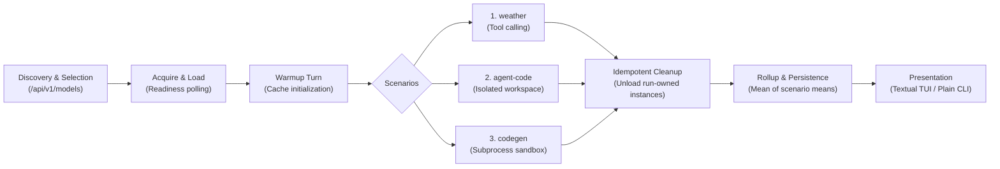
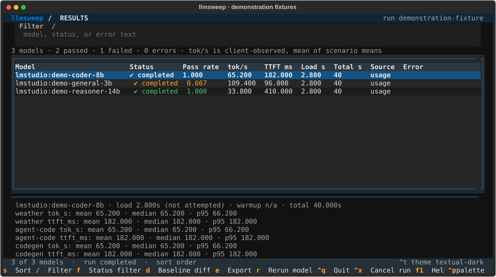
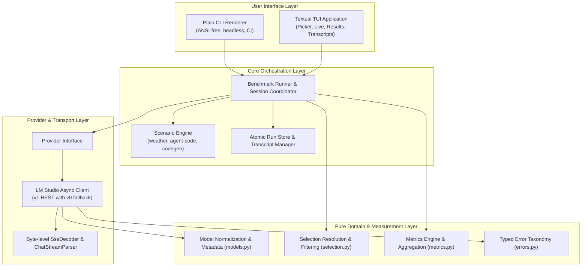
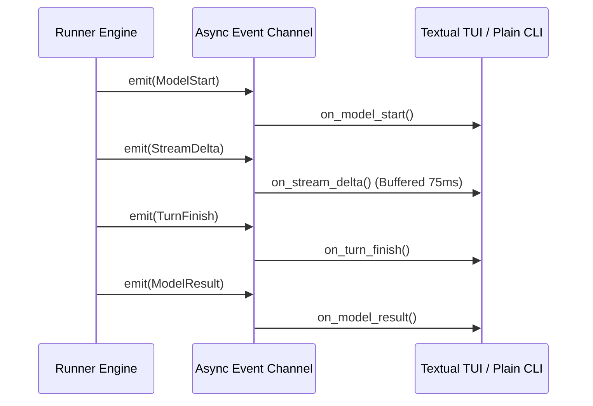
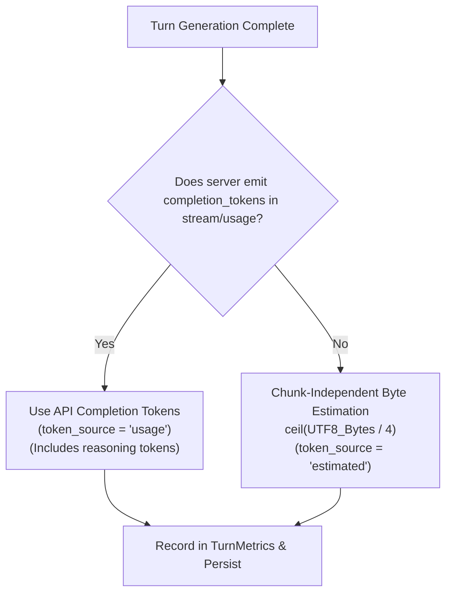

# llmsweep

<p align="center">
  <strong>Benchmark agentic, coding, and throughput performance of local LM Studio models.</strong>
</p>

<p align="center">
  
  
  
  
  
  
  
</p>

---

`llmsweep` is a developer-focused benchmarking suite and interactive [Textual](https://textual.textualize.io/) terminal user interface (TUI) for local Large Language Models running on [LM Studio](https://lmstudio.ai/).

Rather than relying on synthetic prompts or server-side API optimism, `llmsweep` exercises models against real-world multi-step tool use, codebase navigation and bug fixing, and algorithmic code synthesis. It measures **client-observed throughput**, **time-to-first-token (TTFT)**, and **lifecycle loading latency** with statistical rigor, and features built-in baseline regression gating for automated CI/CD testing.

---

## Table of Contents

1. [Benchmark Execution Flow](#benchmark-execution-flow)
2. [Key Highlights](#key-highlights)
3. [Terminal Preview](#terminal-preview)
4. [System Architecture](#system-architecture)
   - [Pure Domain & Logic Layer](#1-pure-domain--logic-layer)
   - [Provider Layer (LM Studio)](#2-provider-layer-lm-studio)
   - [Core Runner & Scenario Engine](#3-core-runner--scenario-engine)
   - [Run Storage & Persistence](#4-run-storage--persistence)
   - [UI & Presentation Decoupling](#5-ui--presentation-decoupling)
5. [Benchmark Scenarios](#benchmark-scenarios)
   - [Scenario Overview](#scenario-overview)
   - [weather — Structured Tool Calling](#weather--structured-tool-calling)
   - [agent-code — Autonomous Bug Fixing](#agent-code--autonomous-bug-fixing)
   - [codegen — Algorithmic Code Synthesis](#codegen--algorithmic-code-synthesis)
   - [Scenario State & Isolation Guarantees](#scenario-state--isolation-guarantees)
6. [Metrics & Scoring Methodology](#metrics--scoring-methodology)
   - [Time-to-First-Token (TTFT)](#time-to-first-token-ttft)
   - [Client-Observed Throughput](#client-observed-throughput)
   - [Scenario Sample Pooling & Model Aggregation](#scenario-sample-pooling--model-aggregation)
   - [Token Accounting & Fallbacks](#token-accounting--fallbacks)
   - [Multi-Repeat Statistics](#multi-repeat-statistics)
   - [Model Lifecycle Metrics](#model-lifecycle-metrics)
   - [Baseline Comparisons & Regressions](#baseline-comparisons--regressions)
7. [Installation & Requirements](#installation--requirements)
8. [Provider Matrix](#provider-matrix)
9. [Quick Start & Common Recipes](#quick-start--common-recipes)
10. [CLI Command & Flag Reference](#cli-command--flag-reference)
    - [Global Usage](#global-usage)
    - [Subcommands](#subcommands)
    - [llmsweep run Flags](#llmsweep-run-flags)
    - [Model Selection Syntax](#model-selection-syntax)
11. [Interactive Terminal UI (Textual)](#interactive-terminal-ui-textual)
    - [TUI Screens](#tui-screens)
    - [Keyboard Shortcuts](#keyboard-shortcuts)
12. [Configuration & Precedence](#configuration--precedence)
13. [Exit Codes](#exit-codes)
14. [Design Rationale & Resolved Assumptions](#design-rationale--resolved-assumptions)
15. [Development & Testing](#development--testing)
16. [Documentation Platform (Mintlify)](#documentation-platform-mintlify)
17. [License](#license)

---

## Benchmark Execution Flow



---

## Key Highlights

- 🛠️ **Three Dedicated Scenarios**:
  - **`weather`**: Multi-turn OpenAI-compatible function calling with parameter validation and regex verification.
  - **`agent-code`**: Agentic workspace inspection (`list_files`, `read_file`, `grep`), guarded bug fixing (`write_file`), and independent test runner verification.
  - **`codegen`**: Algorithmic Python synthesis from strict specifications, validated inside a sandboxed subprocess with execution timeouts.
- ⏱️ **Client-Observed Measurement Fidelity**:
  - Dispatched-to-first-token latency (**TTFT**), excluding role-only headers and empty usage frames.
  - Streamed-window throughput (**tok/s**), calculated strictly from first to last token chunk.
  - Model throughput aggregated as the **mean of scenario means** to prevent scenario length bias.
  - Multi-run statistical rollups: **Mean**, **Median**, and **Nearest-Rank p95**.
- 🔄 **Lifecycle & Resource Protection**:
  - Automated loading with 1-second readiness polling and load duration tracking.
  - Primes compute pipelines and KV-caches with a single warmup query.
  - Idempotent unload with verification: only unloads instances created during the active benchmark run, preserving pre-existing models.
- 🖥️ **Dual Interface**:
  - **Textual TUI**: Interactive Model Picker, live streaming dashboard (buffered at 75 ms intervals for 1000+ deltas/sec), throughput sparklines, and transcript inspector.
  - **Plain CLI**: Pipeable, deterministic, ANSI-free plain text tables ideal for terminal scripts, redirected logs, and CI pipelines.
- 📉 **Regression Gating**:
  - Compare results against historical `--baseline` runs. Automatically flags regressions $> 5\%$ on scenario means and, with `--fail-on-regression`, exits with code `3`.
- 💾 **Local Offline Storage**:
  - Fully schema-versioned runs and turn-by-turn transcripts written atomically to disk. View or export (`json`, `csv`, `markdown`) completely offline.

---

## Terminal Preview



Captured from `App.export_screenshot()` in a headless Textual session. The displayed
model names and measurements are deterministic demonstration fixtures, not live benchmark claims.
Regenerate with `uv run --extra dev python -m tests.capture_screenshot`.

---

## System Architecture

`llmsweep` is structured into clean, decoupled layers with strict separation of concerns between protocol parsing, provider interactions, benchmark execution, persistence, and user presentation.



### 1. Pure Domain & Logic Layer

All domain models, selection logic, stream decoders, and metrics calculators in `llmsweep` are implemented without I/O dependencies. This design enables exhaustive, deterministic unit testing using static fixtures and simulated streams.

- **Stream Processing (`src/llmsweep/streams.py`)**:
  - `SseDecoder`: Incremental, byte-level Server-Sent Events decoder. It accommodates arbitrary chunk boundaries across TCP packets—including multi-byte UTF-8 code point splits, mid-line splits, carriage returns, comments, and multi-line data payloads. Bare NDJSON payloads without `data:` prefixes are safely ignored.
  - `ChatStreamParser`: Converts SSE data envelopes into normalized stream events (`TextDelta`, `ReasoningDelta`, `ToolCallDelta`, `FinishEvent`, `UsageEvent`). Crucially, role-only headers and empty usage frames do **not** trigger output delta timestamps, guaranteeing uninflated TTFT measurements.
- **Model Representation (`src/llmsweep/models.py`)**:
  - `ModelRef`: Identifies models globally as a `(provider, id)` pair (e.g. `lmstudio:qwen2.5-coder-7b-instruct`).
  - `ModelInfo`: Encapsulates metadata, including parameter sizes (parsed via `params_string` with regex fallback), quantization tags, loaded instance IDs, and advertised capabilities (such as tool-use support). Non-chat architectures (embeddings, rerankers) are categorized and excluded from chat benchmarks.
- **Selection Engine (`src/llmsweep/selection.py`)**:
  - Resolves CLI expressions or TUI selections deterministically.
  - Supports exact model identifier matches, 1-based index numbers and ranges (e.g., `1-3,5,7-9`), and unique substring matches. Deduplicates targets while preserving user-specified execution order.
- **Measurement Engine (`src/llmsweep/metrics.py`)**:
  - `TurnRecorder`: Tracks per-turn timings from dispatch to the first and last output deltas.
  - Aggregates multi-turn scenario samples and repeats using mean, median, and nearest-rank p95 calculations.
  - Evaluates regressions against baseline metrics using configurable variance thresholds (default: 5%).
- **Typed Error Taxonomy (`src/llmsweep/errors.py`)**:
  - Structured hierarchy rooted at `LlmsweepError` distinguishing transport errors (`ConnectionFailedError`, `RequestTimeoutError`), HTTP status failures (`AuthenticationError`, `HttpStatusError`), model lifecycle failures (`ModelLoadError`, `ModelUnloadError`), and store corruption.

### 2. Provider Layer (LM Studio)

`llmsweep` connects to local inference engines via an asynchronous `httpx` adapter adhering to a strict provider lifecycle interface.

- **Discovery & Version Negotiation**: Discovery begins against the **LM Studio v1 API** (`/api/v1/models`). If an HTTP 404, 405, or 501 is received, the client gracefully falls back to the legacy **v0 API**. Network timeouts, transport errors, or authentication failures do not trigger fallback.
- **Cold / Preloaded Detection**: The provider snapshots all loaded model instances before initiating tests.
- **Instance Loading**: When an unloaded model is required, the provider issues a load request, extracts the unique runtime instance ID, and polls readiness every 1.0 second until the model is operational or the load deadline expires.
- **Warmup Turn**: One `max_tokens: 8` warmup query is issued prior to scenario execution to ensure weights, KV-caches, and compute buffers are fully resident in VRAM.
- **Idempotent Cleanup**: When execution finishes (or when cancelled via `Ctrl+X` in the TUI), `llmsweep` unloads *only* instances spawned during the current session, verifying their deallocation. Preloaded user models remain untouched.

### 3. Core Runner & Scenario Engine

The central `Runner` coordinates benchmark orchestration, timing, and isolated scenario execution.

- **Serial by Default**: Models are evaluated sequentially to prevent GPU resource contention, VRAM exhaustion, or thermal throttling from corrupting latency and throughput statistics.
- **Subprocess Confinement**: Scenario evaluation scripts run in dedicated child processes with sanitized environments (`PYTHONPATH`, `PATH`). Strict resource boundaries enforce execution timeouts (e.g. 15-second cap on code generation execution) and process-group termination (`killpg`) to eliminate orphan tasks.
- **State Reset**: Each repeat of a scenario starts with fresh execution state and clean temporary workspaces.

### 4. Run Storage & Persistence

Benchmark results and conversation transcripts are written to disk with atomic safety guarantees.

- **Storage Format**: Schema-versioned JSON documents written under the platform-specific data directory (`~/.local/share/llmsweep` on Linux, `~/Library/Application Support/llmsweep` on macOS).
- **Atomic Writes**: Runs and transcripts are written to temporary sibling files and committed using atomic file replacement (`os.replace`) to ensure crash resilience.
- **Transcripts**: Full turn-by-turn prompts, tool execution outputs, model thought processes, and raw completions are preserved for offline post-mortem debugging.
- **Offline Inspection**: The `llmsweep show` and `llmsweep export` commands read directly from the local store without requiring an active LM Studio connection.

### 5. UI & Presentation Decoupling

Rendering is strictly decoupled from measurement logic. Neither the Plain CLI renderer nor the Textual TUI computes scores or metrics; both consume normalized event streams produced by the `Runner`.



- **Textual Terminal UI**: Managed via Textual `@work` workers on the main App (`exit_on_error=False`, `exclusive=False`), tracking each worker by model reference. Streaming chunks are queued and flushed at 75 ms intervals to prevent event-loop saturation during high-throughput bursts (>1,000 deltas/sec).
- **Headless Plain CLI**: Activated via `--plain`, or automatically enabled when non-interactive environments are detected (pipes, redirected stdout, `TERM=dumb`, or CI systems). Emits clean, ANSI-free tabular output.

---

## Benchmark Scenarios

All scoring is deterministic. Each scenario repeat receives fresh conversation
history and a temporary workspace that is removed on completion, error, or cancellation.

| Scenario | Turns | Pass condition |
| --- | --- | --- |
| `weather` | 6 | All three tools called and final answer matches the Fahrenheit expression below. |
| `agent-code` | 10 | `write_file` called and the canonical tests pass on an independent rerun. |
| `codegen` | 1 | Extracted `fib(n)` passes every checker assertion within 15 seconds. |

### `weather`

The task requests Paris weather, conversion to Fahrenheit, and the current time
in `Europe/Paris`, followed by one closing sentence. Tools are:

- `get_weather(city)`: Paris returns 18.0 °C, partly cloudy.
- `convert_temperature(value, from_unit, to_unit)`: supports `c`, `f`, and `k`; rounds to two decimals.
- `get_current_time(timezone)`: uses `zoneinfo`; invalid zones return a clean tool error.

Pass requires all three tool names and a case-insensitive match of
`64(\.4)?\s*(°|deg(rees)?)?\s*f` in the final answer. The time text is not independently
scored. `--task` selects weather with custom instructions and reports success as `n/a`.

### `agent-code`

The workspace contains `README.md`, `buggy.py`, and `tests.py`. The defect is
`range(1, len(items))` in `total(items)`, which skips the first value.

- `list_files()` lists workspace files.
- `read_file(path)` truncates at 4,000 characters.
- `grep(pattern, path?)` caps matches at 50 and reports `truncated`.
- `write_file(path, content)` accepts only `buggy.py`; other files return a read-only error.
- `run_tests()` returns `passed` and the last 500 output characters.

Tools reject absolute paths, traversal, and paths resolving outside the workspace.
The independent canonical tests assert totals for `[1,2,3]`, `[]`, `[5]`, `[-1,1,0]`,
and `range(100)`. A write call and a successful checker exit are both required.
The checker must reach its completion marker; early process exit is not a pass.

### `codegen`

One completion is asked for a fenced Python block defining `fib(n)`. The first
fenced block is extracted; without a fence, the whole trimmed answer is used.
Unfenced valid Python may pass; prose and `return n` fail. The checker asserts
`fib(0)==0`, `fib(1)==1`, the first ten Fibonacci numbers, `fib(20)==6765`, and exact
`int` return types for the first ten values. Timeout reports `checker timed out`.
Negative inputs and `fib(100)` are not part of this benchmark.

Models explicitly advertising no tool support skip the two tool scenarios (`n/a`),
with no expected tools added. Unknown capability is attempted unless
`--require-tool-use` was requested.

These subprocesses provide workflow confinement, not an OS security sandbox.
Generated Python still executes with the current user's operating-system permissions.

---

## Metrics & Scoring Methodology

`llmsweep` prioritizes measurement accuracy and transparency. Benchmarking local LLMs requires accounting for stream chunking variability, token counting discrepancies, model warmups, and hardware latency.

### Time-to-First-Token (TTFT)

$$\text{TTFT (ms)} = (t_{\text{first\_output}} - t_{\text{dispatched}}) \times 1000$$

- **Start Marker ($t_{\text{dispatched}}$)**: Captured immediately before invoking the provider completion request; includes transport setup and queueing.
- **Stop Marker ($t_{\text{first\_output}}$)**: Captured upon receiving the first `TextDelta`, `ReasoningDelta`, or `ToolCallDelta`.
- **Excluded Overhead**: Role-only headers (`{"role": "assistant"}`) and initial empty usage envelopes do **not** trigger the stop marker.

### Client-Observed Throughput

$$\text{Throughput (tok/s)} = \frac{\text{Output Tokens}}{t_{\text{last\_output}} - t_{\text{first\_output}}}$$

- **Streaming Window**: Spans strictly from the first output token chunk to the final output token chunk ($t_{\text{last\_output}} - t_{\text{first\_output}}$).
- **Excluded Non-Generation Time**: Request queuing, connection establishment, model loading, warmup queries, tool execution, and local test checker validation.
- **Zero-Duration Handling**: If output generation completes in zero measurable seconds (single-chunk instantaneous return), the turn yields `n/a` rather than an infinite throughput value.

### Scenario Sample Pooling & Model Aggregation

#### Scenario Sample Pooling
For multi-turn scenarios, throughput is pooled across turns rather than averaged by turn to prevent short turns from skewing calculations:

$$\text{Throughput}_{\text{sample}} = \frac{\sum_{i=1}^{N} \text{Output Tokens}_i}{\sum_{i=1}^{N} \text{Generation Time}_i}$$

#### Model-Level Throughput: Mean of Scenario Means
Because different scenarios feature radically different prompt structures and completion lengths, simple token pooling across heterogeneous scenarios would bias metrics toward whichever scenario produced the highest token volume.

To maintain balanced weighting across tool-calling, agentic workflows, and pure coding, **overall model throughput is defined as the mean of scenario means**:

$$\text{Throughput}_{\text{model}} = \frac{1}{M} \sum_{s=1}^{M} \overline{\text{Throughput}}_s$$

Where $\overline{\text{Throughput}}_s$ is the arithmetic mean throughput of scenario $s$ across its repeats, and $M$ is the number of evaluated scenarios.

---

### Token Accounting & Fallbacks



1. **API-Reported Usage (`token_source: "usage"`)**: Prefers explicit `completion_tokens` delivered in the final SSE `usage` packet (including reasoning tokens).
2. **Chunk-Independent Fallback (`token_source: "estimated"`)**: When usage packets are omitted, token volume is estimated deterministically as:
   $$\text{Estimated Tokens} = \left\lceil \frac{\text{len}(\text{output\_bytes})}{4} \right\rceil$$
3. **Source Tracking**: Stored with each turn and reported in exports. Comparisons between runs with mismatched token sources emit an explicit warning.

---

### Multi-Repeat Statistics

When `--repeat <n>` is set ($n > 1$), `llmsweep` computes statistical distributions across samples:
- **Mean**: Arithmetic average ($\mu$).
- **Median**: 50th percentile sample value.
- **Nearest-Rank p95**: 95th percentile computed using the nearest-rank method:
  $$p95 = X_{\lceil 0.95 \times K \rceil}$$
  where $X$ is the sorted array of valid numeric observations of length $K$.

---

### Model Lifecycle Metrics

- **Model Load Time (`load_s`)**: For models loaded on demand, records the duration required to load weights and reach ready status. Prefers reported load duration from LM Studio; otherwise measured via readiness polling. Preloaded models record `load_s: null` with status `preloaded`.
- **Warmup Turn**: A single minimal completion request is issued after loading to initialize memory maps, GPU compute pipelines, and KV-caches before benchmark measurements commence.

---

### Baseline Comparisons & Regressions

When `--baseline <path_to_run.json>` is passed, `llmsweep` matches runs on `(provider, model_id, scenario)` tuples and flags performance variances against baseline scenario means:

- **Higher-is-Better (Throughput)**:
  $$\Delta_{\text{tok/s}} = \frac{\text{Baseline} - \text{Current}}{\text{Baseline}} \times 100$$
- **Lower-is-Better (TTFT)**:
  $$\Delta_{\text{latency}} = \frac{\text{Current} - \text{Baseline}}{\text{Baseline}} \times 100$$

#### Threshold & CI Exit Code
- **Variance Threshold**: Default 5.0%.
- If current throughput drops by $> 5\%$, or TTFT increases by $> 5\%$:
  - Marked with visual warning indicators (`▼ REGRESSION (+X.X%)`).
  - With `--fail-on-regression`, the command exits with code **`3`** (Regression Failure).
- Invalidation warnings are emitted if token sources differ, benchmark settings differ, or parallel execution contention occurred.

---

## Installation & Requirements

### System Requirements

- **Python**: 3.11 or later
- **Operating System**: macOS or Linux
- **LM Studio**: Running locally with developer server enabled (default: `http://localhost:1234`).

### Using `uv` (Recommended)

```bash
# Clone the repository
git clone https://github.com/jamesbrendamour/llm-bench.git
cd llm-bench

# Install package
uv sync
uv run llmsweep --help

# For development (includes pytest, textual-dev, ruff, mypy)
uv sync --extra dev
```

### Using Standard `pip`

```bash
pip install .
```

---

## Provider Matrix

| Provider | Discovery | Chat | Lifecycle | Tokens | Cost |
| --- | --- | --- | --- | --- | --- |
| LM Studio | `/api/v1/models`, fallback `/api/v0/models` | `/v1/chat/completions`, SSE | v1 instance load/unload; v0 JIT | usage, otherwise flagged estimate | — (not billed) |

Ollama, generic OpenAI, and OpenRouter are deferred. See [design and assumptions](docs/design_rationale_and_assumptions.md).

## Quick Start & Common Recipes

### 1. Interactive TUI Exploration
Launch the interactive model picker to browse models, inspect parameter counts, and watch live benchmark streaming:

```bash
llmsweep run
```

### 2. Benchmark Specific Models by Name or Substring
Benchmark targeted models in headless plain text mode:

```bash
llmsweep run --plain --models "qwen2.5-coder-7b,deepseek-coder"
```

### 3. Select Models by Index Range
List models, then run benchmarks against indices `1`, `2`, `3`, and `5`:

```bash
llmsweep list
llmsweep run --plain --models "1-3,5" --repeat 3
```

### 4. Continuous Integration Regression Test
Assert current performance against an established baseline in CI pipelines:

```bash
llmsweep run --plain \
  --models "qwen2.5-coder-7b-instruct" \
  --baseline "baselines/qwen_v1.json" --fail-on-regression \
  --json "artifacts/latest_run.json"
```
*If throughput or TTFT degrades by $> 5\%$, `llmsweep` returns exit code `3`.*

### 5. Inspect Past Runs Offline
Review results and full conversational transcripts without connecting to the server:

```bash
llmsweep show /path/to/run-directory
llmsweep show /path/to/run-directory --plain
```

---

## CLI Command & Flag Reference

Use `llmsweep COMMAND [OPTIONS]`. Omitting the command selects `run`.
Top-level `--list` and `--show PATH` are compatibility aliases. Use
`llmsweep run --help` for argparse's full usage.

| Command | Purpose |
| --- | --- |
| `run` | Benchmark selected models; opens the picker in an interactive terminal. |
| `list` | List eligible chat models, largest parameter count first. |
| `show PATH` | Open a run directory or `run.json` offline; `--plain` prints tables. |
| `export PATH --json FILE --csv FILE --markdown FILE` | Export one or more formats offline. |
| `doctor` | Check discovery, authentication, API version, and store writability without chat. |
| `providers` | Show the supported provider: `lmstudio`. |

| Flag | Default / meaning |
| --- | --- |
| `--models SPEC`, `--all` | IDs, indices/ranges, or unique substrings; mutually exclusive. Plain runs require one. |
| `--provider NAME`, `--providers NAMES` | Only `lmstudio` is implemented in v1. |
| `--base-url URL` | Server origin; defaults to `http://localhost:1234`. |
| `--host HOST`, `--port PORT` | Alternative to `--base-url`; default `localhost`, `1234`. |
| `--api-key KEY` | Optional credential; prefer environment variables to avoid shell history. |
| `--require-tool-use` | Select models advertising tool support. |
| `--exclude a,b` | Exclude matching model IDs/substrings. |
| `--scenarios LIST` | `weather,agent-code,codegen`; preserves order and deduplicates. |
| `--task TEXT` | Custom weather task, scored `n/a`; rejects explicitly selected other scenarios. |
| `--repeat N` | Repeats per scenario; default `1`. |
| `--max-turns N` | Override weather's 6 and agent-code's 10 turns; codegen stays single-turn. |
| `--max-tokens N` | Completion limit; default `1024`. |
| `--timeout SECONDS` | Per-request inactivity timeout; default `300`. |
| `--load-timeout SECONDS` | Load/readiness ceiling; default and maximum `600`. |
| `--no-warmup` | Skip the one 8-token warmup request per model. |
| `--no-unload`, `--keep-loaded` | Retain instances loaded by the run. Pre-existing instances are always retained. |
| `--parallel N` | Default `1`; values above 1 require preloaded models and mark timings contended. |
| `--plain`, `--no-color` | Plain mode / monochrome TUI; `NO_COLOR` is honored. |
| `--verbose` | Include tool events in stderr or the TUI log. |
| `--transcript-dir DIR` | Additional transcript destination, grouped by run ID. |
| `--sort-by KEY` | `order`, `tok_s`, `ttft`, `total`, `load`, `model`; `cost` is rejected in LM Studio v1. |
| `--json PATH`, `--csv PATH`, `--markdown PATH` | Explicit export destinations. |
| `--baseline PATH` | Compare with a saved run directory or JSON file. |
| `--fail-on-regression` | Exit 3 for comparable regressions beyond thresholds; requires a baseline for runs. |
| `--run-store DIR` | Override the platform data directory. |
| `--config PATH` | Explicit TOML file instead of the project `llmsweep.toml`. |
| `--list`, `--show PATH` | Top-level compatibility aliases. |

Connection flags apply to `run`, `list`, and `doctor`; exports and baseline flags
apply to `run`, `show`, and `export`. Unknown or inapplicable flags are usage errors.

---

### Model Selection Syntax

When specifying `--models <spec>`, `llmsweep` resolves terms using a deterministic priority hierarchy:

1. **Exact Ref**: Matches `provider:id` or exact ID (e.g. `lmstudio:qwen2.5-coder-7b-instruct`).
2. **1-Based Index Ranges**: Matches positions from `llmsweep list`. Supports single indices (`1`), comma-separated lists (`1,3,5`), and continuous hyphenated ranges (`1-3,5-7`).
3. **Unique Substring**: Case-insensitive substring match (e.g. `coder-7b`). Ambiguous matches raise a descriptive error without guessing.

---

## Interactive Terminal UI (Textual)

Running `llmsweep run` in an interactive terminal opens the full Textual TUI:

### TUI Screens
- **Model Picker**: Interactive list with search filtering, parameter sizes, and selection toggling.
- **Live Streaming Runner**: Real-time progress bars, response streaming (buffered at 75 ms intervals to prevent UI stutter), and per-turn metrics.
- **Results Dashboard**: Summary tables with TTFT, tok/s, pass/fail status, and color-coded regression arrows.
- **Transcript Viewer**: Drill down into raw turn messages, tool calls, and model completions.

### Keyboard Shortcuts

| Shortcut | Action |
| --- | --- |
| `Space` / `Enter` in picker table | Toggle model selection |
| `Ctrl+R` | Start selected models |
| `/`, `t`, `e` | Search; tools-only; narrow to explicitly known chat types |
| `Tab` / `Shift+Tab` | Move widget focus |
| `Ctrl+X`, `Esc` on Live | Cancel, clean up run-owned instances, and save partial results |
| `Ctrl+C` | Show the quit/cancel reminder |
| `Ctrl+Q` | Clean up and quit |
| `F1` | Toggle Textual's built-in HelpPanel |
| `s`, `Enter`, `d`, `e`, `r` on Results | Sort, transcript, baseline diff, export, rerun selected model |
| `n`, `p`, `y` in Transcript | Next repeat, previous repeat, copy JSON |

Textual's command palette remains enabled. `p` does not switch providers in this
LM Studio-only release. Pipes, `CI`, and `TERM=dumb` select plain mode before App construction.

---

## Configuration & Precedence

Precedence is CLI > `LLMSWEEP_*` environment > project `./llmsweep.toml` >
`platformdirs.user_config_path("llmsweep") / "llmsweep.toml"` > defaults.
An explicit `--config PATH` replaces the project file. Keys are validated;
unknown keys and literal `api_key` values are errors. Provider settings use
`[providers.lmstudio]`. Deferred provider blocks are not activated in this release.

```toml
repeat = 3
scenarios = "weather,agent-code,codegen"
require_tool_use = false
keep_loaded = false

[providers.lmstudio]
base_url = "http://localhost:1234"
timeout = 300.0
load_timeout = 600.0
api_key_env = "LMSTUDIO_API_KEY"

[thresholds]
tok_s_regression_pct = 5.0
ttft_regression_pct = 5.0
```

| Environment variable | Meaning |
| --- | --- |
| `LMSTUDIO_API_KEY` | Preferred provider credential; `LLMSWEEP_API_KEY` is the fallback. |
| `LLMSWEEP_BASE_URL` | Server URL. |
| `LLMSWEEP_HOST`, `LLMSWEEP_PORT` | Hostname and port, when no base URL is configured. |
| `LLMSWEEP_TIMEOUT`, `LLMSWEEP_LOAD_TIMEOUT` | Request and readiness timeouts. |
| `LLMSWEEP_RUN_STORE` | Persistent run directory. |
| `LLMSWEEP_PLAIN` | Boolean (`true`, `false`, `1`, `0`, `yes`, `no`). |
| `NO_COLOR` | Disable colors in both renderers. |

Other root settings use the corresponding `LLMSWEEP_` uppercase name.
Credentials are redacted in error messages, logs, transcripts, and exports.
Redirects are disabled so credentials stay on the configured provider origin.

---

## Exit Codes

`llmsweep` provides standard exit codes for automated testing and CI pipelines:

| Exit Code | Meaning | Cause |
| :---: | :--- | :--- |
| **`0`** | **Success** | Execution completed; a deterministic scoring failure alone does not change the exit code. |
| **`1`** | **Model Error** | One or more models encountered an unrecoverable execution or API error. |
| **`2`** | **Setup / Config Error** | Invalid flags, unparseable model/scenario expressions, or missing config. |
| **`3`** | **Regression Failure** | Comparable regression beyond the configured threshold under `--fail-on-regression`. |
| **`4`** | **Auth Failure** | Non-retryable authentication or authorization error (HTTP 401/403). |

---

## Design Rationale & Resolved Assumptions

1. **LM Studio v1 with v0 Fallback**: LM Studio v1 REST API (`/api/v1/models`, `/v1/chat/completions`) provides richer capability discovery, structured instance tracking, and explicit load timing. Discovery falls back to v0 if and only if the server returns HTTP 404, 405, or 501. In v0, models may load JIT; `load_s` is reported honestly as `null` with a v0 JIT-loading note.
2. **Client-Observed vs Server-Reported Throughput**: Server-side metrics often compute throughput using raw internal forward-pass durations, ignoring serialization, buffer queuing, and streaming overhead. Measuring from first to last output delta reflects real-world client performance.
3. **Mean of Scenario Means**: Different scenarios produce widely varying token counts (e.g. `weather` generates 40 tokens per turn; `agent-code` generates hundreds across multi-file edits). Averaging scenario means prevents coding scenarios from dominating overall model rankings.
4. **Token Counting Fallback**: Prefers API `completion_tokens` (including native reasoning tokens); falls back to $\lceil \text{bytes} / 4 \rceil$ when usage packets are omitted. The source is permanently recorded to ensure transparent comparisons.
5. **Workflow Confinement vs OS Virtualization**: `agent-code` tools enforce directory traversal guards (`..`, absolute paths, symlink escapes) and restrict modifications to permitted code files. Subprocesses run with sanitized environments, timeouts, and process-group isolation (`killpg`).
6. **Independent Test Verification**: In `agent-code`, the model performs file edits. Once complete, an independent test runner evaluates the test suite in an isolated subprocess outside the LLM's control.
7. **Pure Event-Driven UI Separation**: The `Runner` executes benchmark logic independently and emits normalized events over an asynchronous channel. Neither renderer calculates scores or metrics.
8. **Stream Buffering (75 ms)**: High-speed local models emitting $> 1,000$ deltas/second can saturate terminal event loops. The TUI queues deltas and flushes every 75 ms to bound widget updates to roughly 13 per second without dropping data.
9. **Serial Execution Default**: Running multiple local LLM benchmarks simultaneously causes GPU memory contention and invalidates latency metrics. Parallel execution is permitted via `--parallel` only when all target models are preloaded.

---

## Development & Testing

All test suites in `llmsweep` are fully self-contained and run completely offline. An autouse socket guard rejects any unintended network access during test runs.

```bash
# Run unit and contract tests
uv run --extra dev pytest

# Run linter checks
uv run --extra dev ruff check

# Run strict type checking
uv run --extra dev mypy --strict

# Auto-format codebase
uv run --extra dev ruff format
```

---

## Documentation Platform (Mintlify)

`llmsweep` documentation is powered by [Mintlify](https://www.mintlify.com/), located in [`docs/`](docs/).

### Preview Docs Locally

To run the local documentation development server with live reload:

```bash
# Using Mint CLI (Node.js >= 20.17)
cd docs && mint dev

# Or using npm script from repository root
npm run docs:dev
```

Open [http://localhost:3000](http://localhost:3000) in your browser.

### Quality & Validation

Validate the site build and check link integrity:

```bash
# Strict build validation
cd docs && mint validate
# Or: npm run docs:validate

# Broken link detection
cd docs && mint broken-links
# Or: npm run docs:broken-links
```

### Mintlify / GitHub Deployment

Mintlify uses a docs-as-code workflow synchronized with Git:
1. In the [Mintlify dashboard](https://app.mintlify.com/), connect repository `jamesbmour/llm-bench`.
2. Configure the documentation root directory as `docs`.
3. Pushes to the `main` branch automatically trigger a deployment to `https://<subdomain>.mintlify.site`.

---

## License

This project is licensed under the MIT License. See [LICENSE](LICENSE) for details.
