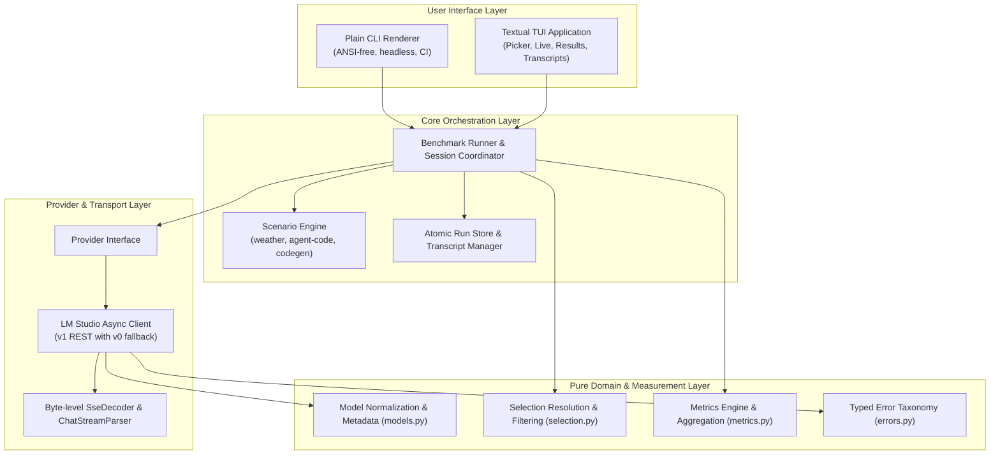
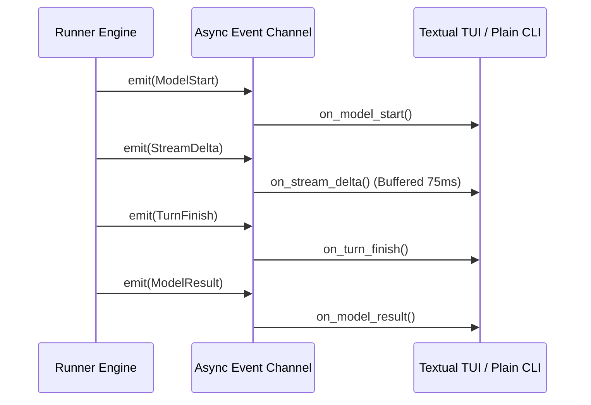

# System Architecture

`llmsweep` is structured into clean, decoupled layers with strict separation of concerns between protocol parsing, provider interactions, benchmark execution, persistence, and user presentation.

---

## 1. Pure Domain & Logic Layer

All domain models, selection logic, stream decoders, and metrics calculators in `llmsweep` are implemented without I/O dependencies. This design enables exhaustive, deterministic unit testing using static fixtures and simulated streams.

### Stream Processing (`src/llmsweep/streams.py`)
- `SseDecoder`: Incremental, byte-level Server-Sent Events decoder. It accommodates arbitrary chunk boundaries across TCP packets—including multi-byte UTF-8 code point splits, mid-line splits, carriage returns, comments, and multi-line data payloads. Bare NDJSON payloads without `data:` prefixes are safely ignored.
- `ChatStreamParser`: Converts SSE data envelopes into normalized stream events:
  - `TextDelta`: Content tokens generated by the model.
  - `ReasoningDelta`: Internal reasoning or "thinking" tokens.
  - `ToolCallDelta`: Indexed tool call fragments (function names and streaming JSON arguments).
  - `FinishEvent`: Stream completion marker with finish reasons (`stop`, `tool_calls`, `length`).
  - `UsageEvent`: Token consumption statistics emitted by the server.

<Note>
Role-only headers and empty usage frames do **not** trigger output delta timestamps, guaranteeing uninflated TTFT measurements.
</Note>

### Model Representation (`src/llmsweep/models.py`)
- `ModelRef`: Identifies models globally as a `(provider, id)` pair (e.g. `lmstudio:qwen2.5-coder-7b-instruct`).
- `ModelInfo`: Encapsulates metadata, including parameter sizes (parsed via `params_string` with regex fallback), quantization tags, loaded instance IDs, and advertised capabilities (such as tool-use support). Non-chat architectures (embeddings, rerankers) are categorized and excluded from chat benchmarks.

### Selection Engine (`src/llmsweep/selection.py`)
- Resolves CLI expressions or TUI selections deterministically.
- Supports exact model identifier matches, 1-based index numbers and ranges (e.g., `1-3,5,7-9`), and unique substring matches.
- Deduplicates targets while preserving user-specified execution order.

### Measurement Engine (`src/llmsweep/metrics.py`)
- `TurnRecorder`: Tracks per-turn timings from dispatch to the first and last output deltas.
- Aggregates multi-turn scenario samples and repeats using mean, median, and nearest-rank p95 calculations.
- Evaluates regressions against baseline metrics using configurable variance thresholds (default: 5%).

---

## 2. Provider Layer (LM Studio)

`llmsweep` connects to local inference engines via an asynchronous `httpx` adapter adhering to a strict provider lifecycle interface.

### Discovery & Version Negotiation
1. Discovery begins against the **LM Studio v1 API** (`/v1/models`).
2. If an `UnsupportedEndpointError` (HTTP 404) is received, the client gracefully falls back to the legacy **v0 API**. Network timeouts, transport errors, or authentication failures do not trigger fallback.
3. Chat completions stream from `/v1/chat/completions` with streaming usage collection enabled.

### Lifecycle Management: Load, Warmup, & Unload
- **Cold / Preloaded Detection**: The provider snapshots all loaded model instances before initiating tests.
- **Instance Loading**: When an unloaded model is required, the provider issues a load request, extracts the unique runtime instance ID, and polls readiness every 1.0 second until the model is operational or the load deadline expires.
- **Warmup Turn**: A single-token warm-up query is issued prior to scenario execution to ensure weights, KV-caches, and compute buffers are fully resident in VRAM.
- **Idempotent Cleanup**: When execution finishes (or when aborted via `Ctrl+C`), `llmsweep` unloads *only* instances spawned during the current session, verifying their deallocation. Preloaded user models remain untouched.

---

## 3. Core Runner & Scenario Engine

The central `Runner` coordinates benchmark orchestration, timing, and isolated scenario execution.

- **Serial by Default**: Models are evaluated sequentially to prevent GPU resource contention, VRAM exhaustion, or thermal throttling from corrupting latency and throughput statistics.
- **Subprocess Confinement**:
  - Scenario evaluation scripts run in dedicated child processes with sanitized environments (`PYTHONPATH`, `PATH`).
  - Strict resource boundaries enforce execution timeouts (e.g. 15-second cap on code generation execution) and process-group termination (`killpg`) to eliminate orphan tasks.
- **State Reset**: Each repeat of a scenario starts with fresh execution state and clean temporary workspaces.

---

## 4. Run Storage & Persistence

Benchmark results and full conversation transcripts are written to disk with atomic safety guarantees.

- **Storage Format**: Schema-versioned JSON documents written under the platform-specific data directory (`~/.local/share/llmsweep` on Linux, `~/Library/Application Support/llmsweep` on macOS).
- **Atomic Writes**: Runs and transcripts are written to temporary sibling files and committed using atomic file replacement (`os.replace`) to ensure crash resilience.
- **Transcripts**: Full turn-by-turn prompts, tool schemas, tool execution outputs, model thought processes, and raw completions are preserved for offline post-mortem debugging.
- **Offline Inspection**: The `llmsweep show` and `llmsweep export` commands read directly from the local store without requiring an active LM Studio connection.

---

## 5. UI & Presentation Layer

Rendering is strictly decoupled from measurement logic. Neither the Plain CLI renderer nor the Textual TUI computes scores or metrics; both consume normalized event streams produced by the `Runner`.

### Textual Terminal UI
- Built using [Textual](https://textual.textualize.io/) with custom TCSS styling.
- Asynchronous execution managed via Textual `@work` workers on the main App (`exit_on_error=False`, `exclusive=False`), tracking each worker by model reference.
- **Buffered Output**: High-frequency streaming chunks are buffered and flushed to widgets at 75 ms intervals, preventing UI thread saturation during bursts (>1,000 deltas/sec).
- **Graceful Cancellation**: `Ctrl+C` initiates safe cancellation, allowing the Runner to persist partial results and trigger provider instance unloads before exiting.

### Headless Plain CLI
- Activated via `--plain`, or automatically enabled when non-interactive environments are detected (pipes, redirected stdout, `TERM=dumb`, or CI systems).
- Emits clean, deterministic, ANSI-free tabular output.
