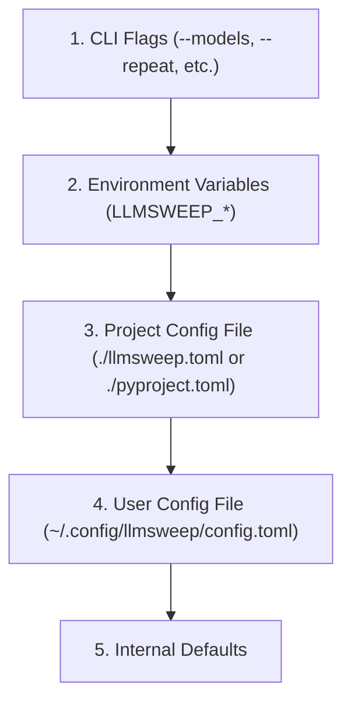

# CLI Reference & Configuration

`llmsweep` provides a comprehensive command-line interface for running benchmarks, inspecting models, reviewing stored results, and diagnosing connectivity.

---

## 1. Global Usage

```bash
llmsweep [OPTIONS] COMMAND [ARGS]...
```

### Global Options

| Option | Description |
| :--- | :--- |
| `-c, --config <path>` | Explicit path to a TOML configuration file. |
| `--verbose` | Enable debug logging to standard error. |
| `--version` | Print application version and exit. |
| `--help` | Show global help information. |

---

## 2. Subcommands

### `llmsweep run`
Execute benchmark scenarios across selected or all models.

```bash
llmsweep run [OPTIONS]
```

#### Options

| Flag | Type | Default | Description |
| :--- | :--- | :---: | :--- |
| `-m, --models <spec>` | String | `None` | Comma-separated list of model IDs, index ranges (`1-3,5`), or unique substrings. In interactive mode without this flag, opens the Model Picker. |
| `-a, --all` | Flag | `False` | Run benchmarks against all available chat models discovered from the server. |
| `-s, --scenarios <list>`| String | `all` | Comma-separated list of scenarios: `weather`, `agent-code`, `codegen`. Defaults to all three. |
| `-r, --repeat <n>` | Integer | `1` | Number of test repetitions per scenario per model. |
| `--plain` | Flag | `False` | Force plain, ANSI-free tabular output instead of the interactive Textual TUI. |
| `--task <prompt>` | String | `None` | Custom prompt for the `weather` tool scenario. Disables automated scoring and rejects combination with other scenarios. |
| `--require-tool-use` | Flag | `False` | Restricts model selection to those explicitly advertising function-calling support in server metadata. |
| `--keep-loaded` | Flag | `False` | Prevent unloading of models after benchmark execution. Alias: `--no-unload`. |
| `--parallel` | Flag | `False` | Execute benchmarks concurrently across selected models. Requires all models to be preloaded. |
| `--baseline <path>` | Path | `None` | Path to a previous run JSON file. Compares performance and flags regressions $> 5\%$. |
| `--json <path>` | Path | `None` | Export full results document to the specified JSON path. |
| `--csv <path>` | Path | `None` | Export aggregated scenario summaries to CSV format. |
| `--markdown <path>` | Path | `None` | Export human-readable results table as Markdown. |
| `--timeout <sec>` | Integer | `300` | Inactivity timeout in seconds for streaming API requests. |
| `--load-deadline <sec>` | Integer | `600` | Maximum wait time in seconds for model loading and readiness verification. |

#### Model Selection Syntax (`--models`)
Selection resolution evaluates terms in the following precedence:
1. **Exact Model ID**: Matches the fully qualified model key (e.g. `lmstudio:qwen2.5-coder-7b-instruct` or `qwen2.5-coder-7b-instruct`).
2. **Index Numbers & Ranges**: 1-based indexing matching `llmsweep list` order. Examples:
   - `1`: First model in list.
   - `1,3,5`: Discrete model selection.
   - `1-3,6-8`: Continuous ranges combined with individual indices.
3. **Unique Substring**: Case-insensitive substring match (e.g. `coder-7b`). If multiple models match, an ambiguous selection error is raised.

---

### `llmsweep list`
List all models available on the LM Studio server.

```bash
llmsweep list [OPTIONS]
```

- Filters out non-chat models (`embedding`, `embeddings`, `reranker`).
- Displays index numbers, parameter sizes (billions), quantization formats, tool-use support flags, and current residency status (`loaded` or `unloaded`).

---

### `llmsweep show`
Inspect past benchmark runs and detailed transcripts offline.

```bash
llmsweep show <run-id|file-path> [OPTIONS]
```

- **`<run-id|file-path>`**: Unique run ID from local store or direct path to a saved `.json` run file.
- **`--transcripts`**: Include full conversational turns, tool calls, and model outputs.
- **`--sort-by <metric>`**: Sort summary table by `tok_s`, `ttft`, `load_s`, or `model`.

---

### `llmsweep export`
Export a completed run from the local store to external formats without network access.

```bash
llmsweep export <run-id> --format <json|csv|markdown> [OPTIONS]
```

- **`--format`**: Target format (`json`, `csv`, `markdown`).
- **`-o, --output <path>`**: Target destination file (prints to stdout if omitted).

---

### `llmsweep doctor`
Verify environment configuration, connectivity, and local storage health without running benchmarks.

```bash
llmsweep doctor
```

Diagnostics performed:
1. **Configuration**: Verifies TOML syntax and validates configuration keys.
2. **Connectivity**: Tests TCP connectivity and HTTP reachability to LM Studio.
3. **API Version**: Detects whether LM Studio v1 or v0 API is responding.
4. **Authentication**: Verifies credentials if configured.
5. **Storage Accessibility**: Verifies read/write permissions for the local run database.

---

### `llmsweep providers`
List supported backend providers.

```bash
llmsweep providers
```

In version 1.0, `lmstudio` is the active supported provider. Requesting unconfigured or deferred providers (e.g. `ollama`, `openrouter`) exits with code `2`.

---

## 3. Configuration & Precedence

`llmsweep` resolves configuration values using the following priority order (highest to lowest):



### Environment Variables

| Variable | Type | Default | Description |
| :--- | :---: | :---: | :--- |
| `LLMSWEEP_HOST` | URL | `http://localhost:1234` | Base URL of the LM Studio server. |
| `LLMSWEEP_API_KEY` | String | `None` | Optional API token for server authentication (redacted in logs and exports). |
| `LLMSWEEP_TIMEOUT` | Float | `300.0` | Default request inactivity timeout in seconds. |
| `LLMSWEEP_LOAD_DEADLINE` | Float | `600.0` | Default timeout for model loading. |
| `LLMSWEEP_DATA_DIR` | Path | Platform default | Directory for persistent storage and transcripts. |
| `LLMSWEEP_PLAIN` | Boolean | `false` | Force plain text output across all commands when set to `1` or `true`. |

### TOML Configuration Example (`llmsweep.toml`)

```toml
[server]
host = "http://localhost:1234"
timeout = 300.0
load_deadline = 600.0

[benchmark]
repeat = 3
scenarios = ["weather", "agent-code", "codegen"]
require_tool_use = false
keep_loaded = false

[regression]
threshold_pct = 5.0
```

---

## 4. Exit Codes

`llmsweep` uses distinct exit codes to support automated CI/CD pipelines and shell scripting:

| Code | Label | Cause |
| :---: | :--- | :--- |
| **`0`** | **Success** | All benchmarks completed; pass/fail criteria satisfied; no regressions beyond threshold. |
| **`1`** | **Model Error** | One or more models encountered an unrecoverable runtime exception, socket termination, or HTTP error. |
| **`2`** | **Configuration Error** | Invalid flags, unparseable model/scenario expressions, unimplemented provider selection, or invalid TOML configuration. |
| **`3`** | **Regression Failure** | All benchmarks finished without errors, but TTFT or throughput regressed $> 5\%$ against the provided baseline. |
| **`4`** | **Authentication Error** | Non-retryable HTTP 401 or 403 response received from the provider. |
