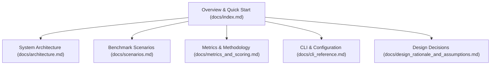

# llmsweep Documentation

Welcome to the documentation for **`llmsweep`**, an automated benchmarking and evaluation suite tailored for local Large Language Models (LLMs) hosted on [LM Studio](https://lmstudio.ai/).

`llmsweep` evaluates models across multi-step tool calling, agentic codebase exploration and bug-fixing, and algorithmic code generation. It tracks performance using strict client-observed metrics (Time to First Token, throughput in tokens/sec, and model loading latency) and multi-run statistical rollups (mean, median, p95).

---

## Documentation Roadmap

- [System Architecture](file:///Users/james/Library/CloudStorage/GoogleDrive-jamesbrendamour3@gmail.com/My%20Drive/GitHub/llm-bench/docs/architecture.md): Deep dive into the modular design, asynchronous runner, stream parsing, provider adapters, decoupled rendering (Textual TUI vs Plain CLI), and atomic persistence store.
- [Benchmark Scenarios](file:///Users/james/Library/CloudStorage/GoogleDrive-jamesbrendamour3@gmail.com/My%20Drive/GitHub/llm-bench/docs/scenarios.md): Comprehensive specifications for the `weather`, `agent-code`, and `codegen` benchmark scenarios, including sandbox confinement, tooling interfaces, and scoring criteria.
- [Metrics & Scoring Methodology](file:///Users/james/Library/CloudStorage/GoogleDrive-jamesbrendamour3@gmail.com/My%20Drive/GitHub/llm-bench/docs/metrics_and_scoring.md): How TTFT, client-observed throughput, token estimation fallbacks, statistical aggregations, and baseline regression thresholds are defined and calculated.
- [CLI Reference & Configuration](file:///Users/james/Library/CloudStorage/GoogleDrive-jamesbrendamour3@gmail.com/My%20Drive/GitHub/llm-bench/docs/cli_reference.md): Command documentation (`run`, `list`, `show`, `export`, `doctor`, `providers`), model/scenario selection syntax, environment variables, configuration precedence, and exit codes.
- [Design Rationale & Assumptions](file:///Users/james/Library/CloudStorage/GoogleDrive-jamesbrendamour3@gmail.com/My%20Drive/GitHub/llm-bench/docs/design_rationale_and_assumptions.md): Rationale behind LM Studio v1/v0 API discovery, process confinement vs container sandboxing, serial execution defaults, and lifecycle management.

---

## Key Highlights

1. **Client-Observed Measurement Fidelity**:
   - Clock timing starts at socket dispatch and measures TTFT strictly up to the first meaningful token delta (content, reasoning, or tool call arguments).
   - Throughput is calculated over the active streaming generation window, excluding connection negotiation, model warm-up, and tool execution overhead.
2. **Deterministic & Isolated Execution**:
   - Scenarios execute within sanitized subprocesses with bounded memory, timeout enforcement, and process-group cleanup.
   - Code changes during the `agent-code` scenario are verified with an independent test suite rerun outside the LLM's control.
3. **Decoupled Architecture**:
   - Pure data structures and streaming parsers ([`streams.py`](file:///Users/james/Library/CloudStorage/GoogleDrive-jamesbrendamour3@gmail.com/My%20Drive/GitHub/llm-bench/src/llmsweep/streams.py), [`metrics.py`](file:///Users/james/Library/CloudStorage/GoogleDrive-jamesbrendamour3@gmail.com/My%20Drive/GitHub/llm-bench/src/llmsweep/metrics.py)) have zero I/O side-effects.
   - The central Runner emits uniform lifecycle and stream events consumed identically by the Plain CLI renderer and the interactive Textual TUI.
4. **Idempotent Lifecycle Handling**:
   - Automatically loads required models, monitors health and readiness, primes execution with warmup turns, and unloads run-instantiated models while preserving preloaded user models.
