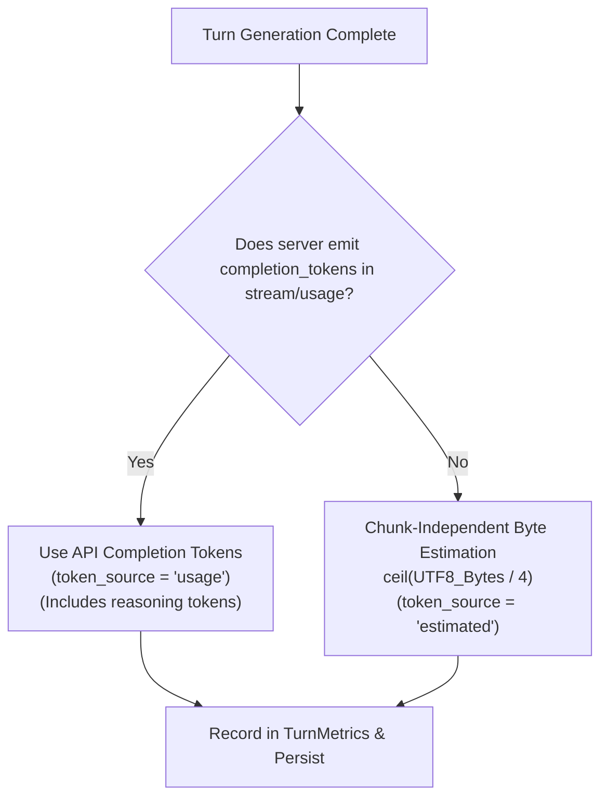

# Metrics & Scoring Methodology

`llmsweep` prioritizes measurement accuracy and transparency. Benchmarking local LLMs requires accounting for stream chunking variability, token counting discrepancies, model warmups, and hardware latency.

---

## 1. Core Latency & Throughput Metrics

### Time-to-First-Token (TTFT)
Time-to-First-Token measures the elapsed time from dispatch until the local engine begins emitting generative output.

$$\text{TTFT (ms)} = (t_{\text{first\_output}} - t_{\text{dispatched}}) \times 1000$$

- **Start Marker ($t_{\text{dispatched}}$)**: Captured the instant the HTTP request payload is sent across the socket.
- **Stop Marker ($t_{\text{first\_output}}$)**: Captured upon receiving the first `TextDelta`, `ReasoningDelta`, or `ToolCallDelta`.
- **Excluded Overhead**: Role-only headers (`{"role": "assistant"}`) and initial empty usage envelopes do **not** trigger the stop marker.

### Client-Observed Throughput
Throughput reflects the actual delivery speed of tokens over the wire as experienced by the client application.

$$\text{Throughput (tok/s)} = \frac{\text{Output Tokens}}{t_{\text{last\_output}} - t_{\text{first\_output}}}$$

- **Streaming Window**: Spans strictly from the first output token chunk to the final output token chunk ($t_{\text{last\_output}} - t_{\text{first\_output}}$).
- **Excluded Non-Generation Time**:
  - Request queuing and connection establishment.
  - Model load duration and warmup queries.
  - Client-side tool execution and mock API response generation.
  - Automated test runner checks and subprocess validation.
- **Zero-Duration Handling**: If an output generation completes in zero measurable seconds (e.g. single-chunk instantaneous return), the turn yields `n/a` rather than an infinite throughput value.

---

## 2. Multi-Turn & Scenario Aggregation

Scenarios often consist of multiple conversational turns (such as tool call requests followed by final natural language summaries).

### Scenario Sample Pooling
For any multi-turn scenario repeat, throughput is pooled across turns rather than averaged by turn to prevent short turns from skewing calculations:

$$\text{Throughput}_{\text{sample}} = \frac{\sum_{i=1}^{N} \text{Output Tokens}_i}{\sum_{i=1}^{N} \text{Generation Time}_i}$$

If any turn has zero or negative generation time, the sample's pooled throughput is `n/a`.

### Model-Level Throughput: Mean of Scenario Means
Because different scenarios feature radically different prompt structures, turn counts, and completion lengths, simple token pooling across heterogeneous scenarios would bias metrics toward whichever scenario produced the highest token volume.

To maintain balanced weighting across tool-calling, agentic workflows, and pure coding, **overall model throughput is defined as the mean of scenario means**:

$$\text{Throughput}_{\text{model}} = \frac{1}{M} \sum_{s=1}^{M} \overline{\text{Throughput}}_s$$

Where $\overline{\text{Throughput}}_s$ is the arithmetic mean throughput of scenario $s$ across its repeats, and $M$ is the number of evaluated scenarios.

---

## 3. Token Accounting & Fallbacks

Accurate token counts are vital for throughput calculations. `llmsweep` resolves token totals using a strict priority hierarchy:

**Token source values**: The `token_source` field on each turn can be:
- `"usage"`: API-reported `completion_tokens` from the SSE usage packet (includes reasoning tokens when reported). This is the preferred and most accurate source.
- `"estimated"`: Byte-based fallback $\lceil \text{bytes} / 4 \rceil$ used when the server omits usage packets or returns null values. Independent of stream chunking boundaries.

<Note>
The type definition also includes a `"server"` literal, but this value is never produced by current code. It exists for forward compatibility with future provider integrations that may report tokens differently from LM Studio's OpenAI-compatible endpoint.
</Note>

---

## 4. Multi-Repeat Statistics

When `--repeat <n>` is set ($n > 1$), `llmsweep` computes statistical distributions across samples:

- **Mean**: Arithmetic average ($\mu$).
- **Median**: 50th percentile sample value.
- **Nearest-Rank p95**: 95th percentile computed using the nearest-rank method over sorted valid observations of length $K$:
  $$p95 = X_{\lceil 0.95 \times K \rceil - 1}$$
  where $X$ is the zero-indexed sorted array (ascending). With a single sample ($K=1$), p95 equals that value; with no valid observations, all statistics are `null`.

---

## 5. Model Lifecycle Metrics

Before executing scenarios, `llmsweep` records cold and warm operational timings:

- **Model Load Time (`load_s`)**:
  - For models loaded on demand, records the duration required to load weights and reach ready status.
  - If LM Studio reports an official load duration in the API response, that value is recorded; otherwise, duration is measured via active readiness polling.
  - Preloaded models (already resident before benchmark start) record `load_s: null` with status `preloaded`.
- **Warmup Turn**: A single minimal completion request is issued after loading to ensure memory maps, GPU compute pipelines, and KV-cache allocations are initialized before benchmark measurements commence.

---

## 6. Baseline Comparisons & Regressions

When `--baseline <path_to_run.json>` is passed, `llmsweep` matches runs on `(provider, model_id, scenario)` tuples and flags performance variances against baseline scenario means.

### Regression Formula
Using `regression_pct`:

- **Higher-is-Better (Throughput)**:
  $$\Delta_{\text{tok/s}} = \frac{\text{Baseline} - \text{Current}}{\text{Baseline}} \times 100$$
- **Lower-is-Better (TTFT)**:
  $$\Delta_{\text{latency}} = \frac{\text{Current} - \text{Baseline}}{\text{Baseline}} \times 100$$

### Threshold & CI Exit Code
- **Variance Threshold**: 5.0% by default.
- If current throughput drops by $> 5\%$, or TTFT increases by $> 5\%$:
  - Marked with visual warning indicators (`▼ REGRESSION (+X.X%)`).
  - With `--fail-on-regression`, the command exits with code **`3`** (Regression Failure), enabling automated CI pipelines to detect performance degradation.

<Warning>
**Comparison Invalidation**: Automatic performance comparison verdicts are suppressed (with diagnostic warnings) if:
- Token sources differ (e.g., comparing `usage` against `estimated`).
- The benchmark repeat counts or scenario configurations do not match.
- Runs occurred under parallel execution contention.
</Warning>

---

For the complete schema reference of how these metrics are persisted in run documents, transcripts, and export formats, see [Data Formats & Exports](data_formats.md).